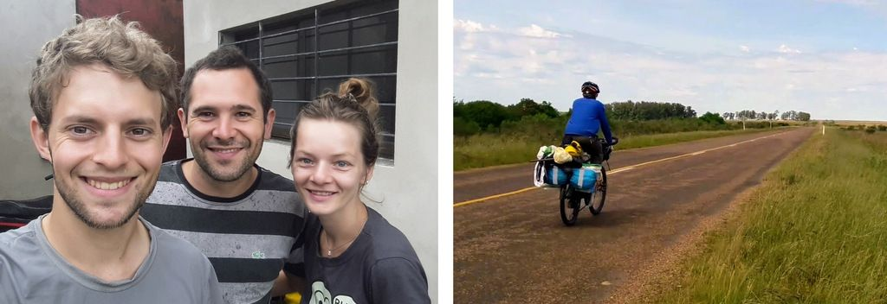

[< Rota, Equipamento, Fotos, Vídeo](https://darenhart.github.io/patagonia-trip)

# Viagem de bicicleta à Patagônia

por daniel werle arenhart

Por volta de dois anos e meio depois de ter voltado, decidi passar a limpo e reviver os manuscritos da caderneta de viagem.

São relatos de uma viagem de bicicleta saindo de Estrela - Brasil até a Patagônia no verão de 2017-2018.

## Sumário

- [Pré Viagem](#pre-viagem)

  - [Motivação](#motivacao)
  - [Quando](#quando)

  - [Equipamento](#equipamento)
  - [Riscos](#riscos)

- [A Viagem](#a-viagem)

  - [Rio Grande do Sul](#rio-grande-do-sul)
    - [Dia 1](#dia-1) ... [Dia 6](#dia-6)
  - [Uruguai](#uruguai)
    - [Dia 7](#dia-7) ... [Dia 20](#dia-20)

  - [Argentina](#argentina)
    - [Dia 7](#dia-7) ... [Dia 20](#dia-20)

## Pré Viagem

### Objetivo

Viajar de Bike

### Motivação

A motivação surgiu de viagens menores feitas anteriormente.

> “Todo sonho é uma derrota em potencial. Para não o realizar, basta manter-se parado” Argus Saturnino

> “A liberdade reside nas coisas simples" Antonio Olinto

> "Quando a gente tá contente, Tanto faz o quente, Tanto faz o frio" Gal Costa

### Quando

Decidi que iria algum momento fazer uma grande viagem pela América do sul, 1 ano e 5 meses antes de ter saído. Dois meses depois, decidi que em mais ou menos um ano sairia e comecei a contar para as pessoas.  O objetivo era sair antes do inicio do verão para pegar um clima mais confortável na Patagônia. Ainda não sabia o tempo que levaria, mas seria menos de 1 ano (foram 4 meses). 

### Equipamento

Comprei o quadro para a bicicleta que eu iria montar para a viagem um ano antes. Escolhi e montei peça por peça para entender bem a mecânica, mas mal eu sabia que na viagem não precisaria nada mais além de passar óleo na correia, remendar câmara e trocar cabos. Para começar a viajar de bicicleta não é preciso se preparar muito nem ter o melhor equipamento, mas me diverti escolhendo cuidadosamente cada um dos itens que levaria buscando leveza, conforto e independência. 

### Riscos

Identifiquei alguns riscos e refleti sobre como evitá-los:

Roubo: Não é um risco vital, não dei muita importância, mas evitar capitais já é suficiente.

Ficar sem água: Sempre levei água extra para cozinhar, cuidar da higiene e lavar louça portanto caso faltasse, abriria mão destes luxos. Tiveram poucos trajetos longos onde não houvesse motoristas para quem poderia pedir ajuda.

Ser atropelado: Evitar capitais e estradas mais movimentadas. A Argentina e Chile no geral tem menos trânsito que no Brasil.

Perder cartão e dinheiro: Não é um risco vital, não dei muita importância, mas tentei separar as coisas em mais de um lugar.

## A Viagem

### Rio Grande do Sul

#### Dia 1 - 13/10/2017

A presença, o bom humor e o apoio das pessoas foi muito importante no dia da saída para começar a viagem. Meu irmão Fafa, o Matheus Bechert e o Adriano (Tinanço) me acompanharam.

Quebrou bagageiro do Fafa e concertamos em um mecânico que encontramos logo em seguida. Ele não queria cobrar nada mas demos 10 reais. Choveu durante a saída e um pouco no resto do dia. Ficamos num camping no interior do município de Sério.

Apesar de todo peso sendo carregado (uns 32 quilos com a bike), a sensação ao iniciar uma viagem de bike é de extrema leveza ao deslizar suavemente sobre o chão levando tudo que se precisa para viver com independência em condições diversas.

#### Dia 2

Visitamos um paredão em uma propriedade particular no arroio Sampaio. 

O Bechert e o Tinanço retornaram para suas casas. Fiquei feliz por eles terem proposto sair junto. Continuamos o Fafa e eu sem muita certeza de qual caminho seguir nos próximos dias. Além disso ainda não tínhamos onde pernoitar, então o Fafa fez uma ligação para o nosso amigo Matheus (Zhen) de Venâncio Aires que nos recebeu super bem. Fomos junto no aniversário do tio dele.

#### Dia 3

O sol começa a aparecer. Casualmente encontramos o Rainão, o tio de um amigo nosso, que nos convidou para almoçar em sua casa e bater um papo. Eu nem sabia que ele morava em Candelária, então foi uma surpresa. Nos recomendaram pernoitar num parque de exposições onde tem água, luz e chuveiro. Estamos começando a nos adaptar melhor ao ritmo da nossa pedalada em dupla.

#### Dia 4 

Em Agudo. Ficamos num balneário inativo com acesso a uma cachoeira. Não tinha ninguém. Vimos Bugios

#### Dia 5

Em Santa Maria

Não tinha tanto movimento para entrar na cidade. Combinamos com nosso amigo Ique de nos encontrar na UFSM. Ficamos no seu quarto numa casa de estudante. Um alívio ter onde ficar numa cidade grande sem precisar ir atras de hotel ou *Warmshower* (rede solidária de hospedagem).

#### Dia 6

No final do dia entre Santa Maria e Rosário do Sul, conversamos com uns homens, em uma mecânica de ônibus, que nos cederam uma cabana onde pudemos passar a noite. Nos convidaram para um mate e mais tarde eles nos ofereceram a janta. Na madrugada foi difícil dormir pois começou uma tempestade que fazia o chão tremer. A localidade se chamava "Cochilha do Pau Fincado"

#### Dia 7

Rosário do sul

Vento contra. Ficamos em uma cabana. Devido ao temporal no dia anterior, não tinha luz nem água em vários estabelecimentos, o que dificultou para nos reabastecer.

#### Dia 8

Santana do Livramento

Estragou a rosca do parafuso que segura o canote do banco. Para poder seguir viagem peguei uma abraçadeira que tinha no meu kit macgyver e fixei a altura dele, porém ainda ficava girando, mas já era melhor que pedalar em pé. Estava escurecendo quando chegamos. Ficamos no Hotel Estrela palace. 

#### Dia 9

Rivera - Dia de Descanso. 

Fomos nos free shops e no caminho muitas pessoas vinham conversar com a gente. Um cara que gritava "Imprensa!" veio fazer uma entrevista para o jornal dele. Arrumamos o canote numa loja de bicicleta, não cobraram nada. Um uruguaio nos convidou para ficarmos na sua casa. Anotamos o endereço depois o encontramos em casa. O Yony, como se chamava, conversava muito e se mostrava preocupado perguntando se não faltava nada. Fomos muito bem acolhidos. 

#### Dia 10

Minha bike tava com furo minúsculo que só conseguimos encontrar quando o Fafa afundou a câmara numa pia na rodoviária. Me despedi do Fafa que acompanhou toda travessia do pampa gaúcho.

As cochilhas do pampa gaúcho vão ficando mais longas e menos íngremes até se tornarem planície. Árvores passam a ser mais raras. Essas mudanças são observadas muito lentamente ao longo de vários dias. Este para-lama transparente que emendei na roda dianteira não resistiu mais muitos dias.

O dia estava ótimo para pedalar: clima bom, estrada pouco movimentada, acostamento bom e nuvens bonitas. A viagem parece estar começando agora. Me sinto cheio de energia para encarar o que vier pela frente. 

Vejo os cataventos e não perco a oportunidade de interpretar Dom Quixote.

Apanhei no chão um pedaço de placa de carro "RS - Uruguaiana".

### Uruguai

#### Dia 11

Dia bom. Cruzei a fronteira para o Uruguai na cidade de Artigas e cheguei cedo. Uma senhora bem querida me recebeu no centro de informações turísticas. Disse que o camping aberto da praça era perigoso portanto acabei fiquei num camping no final da cidade. Ganhei um chip de celular num bazar.

#### Dia 12 

Fiz 100km sem muita dificuldade, talvez por causa do vento a favor. Os uruguaios que encontrava normalmente cumprimentavam. Visualizo da rua um conjunto de árvores agradável para acampamento e não perco a oportunidade. 

#### Dia 13

Depois de passar por alguns povoados, fui perguntar para as pessoas por lugares para *armar la carpa*. O policial disse que só tem campo, uns rapazes me sugeriram um lugar embaixo de uma ponte. Não me atraí pela sugestão, e o que me sobrou foi uma plantação eucaliptos onde não chamaria atenção. Normalmente pulava a cerca e deixava a bike do lado de fora.

Nos pequenos povoados que passei, as casas são pequenas e simples, não vi mercados ou lojas com fachadas chamativas.

Neste dia podia andar mais porém era preciso descansar. Vi um tatu bebê, um graxaim caçando e muitas cutias (roedor gordinho). À noite sou presenteado com muitos vaga-lumes no campo.

#### Dia 14

Em Salto conheci o Gianfranco e a Lidka pela plataforma de hospedagem solidária *Warmshowers*. 

Passeei pela cidade, visitei o Zoológico e as praças. 

#### Dia 15

A barca para cruzar o Rio Uruguai não saiu hoje devido ao tempo ruim. Dia de descanso forçado. Fiquei mais um dia na casa do casal. Me mostraram a pequena fábrica de móveis deles. Eles falam polonês, o Gianfranco um pouco de português também. Fizeram a própria casa. Não usam a rede elétrica, apenas placas solares.

### Argentina - Entre Rios

#### Dia 16 - 28/10/2017

Novamente acordei cedo para tentar pegar a barca. Consultei alguns funcionários mas ninguém sabia exatamente onde nem quando ele saía. Para me deixar mais confuso, quando ouvia a palavra *viernes* (sexta-feira), deduzia que significava inverno. Enfim, nem cheguei a ver a barca então fui até o terminal de ônibus onde casualmente estava para sair um. Tirei os baldes, a roda da frente e larguei tudo no bagageiro.  O ônibus cruza o rio por uma barragem em alguns minutos. Registrei passagem na aduana Argentina. 

Em Concordia, fui na loja da claro para fazer um novo chip. Saindo da loja, no meio de muita gente chega um pai andando com sua família e me cumprimenta, dizendo que também andava de bike. Depois se aproxima para dar um beijo de bochecha e o resto da família também me cumprimenta da mesma forma. Estavam juntos a mãe e duas filhas, todos gordinhos e sorridentes. Aquilo fez meu dia mais alegre. Só mais tarde descobri que este é um cumprimento comum na argentina. Passei um pouco pela cidade e me fui em direção ao povoado de General Campos. Na maioria do caminho tinha uma faixa bloqueada devido a obras que estava perfeita pra andar de bici, era como uma ciclovia gigante. Foi uma maravilha. Na entrada da cidade, um pedalante local me acompanhou e mostrou onde eu podia ficar: uma praça. No mercado, um cidadão me sugeriu avisar a polícia que ficaria por ali e assim o fiz. Chegando na praça, apareceu um garoto de bike que tinha umas conversas um pouco estranhas. Ele dizia ter viajado muito longe de bike, .  não saía da minha cola e dizia . Fui até a praça central e vi o final de uma cerimônia de casamento. 

Voltando para o parque, apareceram uns guris com som alto no carro, desarmei a barraca que já tinha armado e movi para outro canto. Nisso apareceram dois guris, um com um violão. Musicos - que paso. (me falaram sobre san marcos sierras)

#### Dia 17

Domingo. Fui convidado para um assado! Era um grupo de amigos de moto. Todos vieram conversar e queriam tirar foto comigo. Guanhei carona até Bovril. Uma professora que pegava carona para dar aula. Tava com dificuldade de entender pra onde ela ia me lever. Só quando descobri que B tem som de V daí consegui achar Bovril no mapa. Avisei a policia, fiquei num camping, para minha surpresa chegou um cara e disse que não podia. Me mando bem cedo.

#### Dia 18

Paraná - parque enquique Berduc. Andei 100km. Cheguei cedo e não muito cansado, parece que estou criando resistência. Camping free muito lindo! (acompanhava o blog dos Pedarilhos)

#### Dia 19

São Tomé - Fui até Paraná na entrada do tunel. Um supervisor me levou numa caminhonete até o outro lado do túnel. Dei umas voltas até conseguir um oculos EPI escuro. Esse é o teceiro que tenho. Em santa fé também queria trocar uns reais por pesos. Esperei até abrir depois das 16:30 e o cambio não abriu. Fui para o camping municipal..25 pesos.   *falar dos campings municipais* 

#### Dia 20

Sá Pereira. Voltei até Santa Fé para trocar reais e pediram o passaporte... começando o dia andando 15km em vão. Voltei para buscar, tinha um vento lateral a favor. Estrada boa. Fiquei nos bombeiros, deram janta, fomos buscar.  

#### Dia 21

Colonia Cello

Esperei nos bombeiros até parar a chuva. Estrada boa, vento favorável. Cheguei na policia, não tinha ninguém, o visinho começou a conversar e logo já ofereceu a casa. Gaston, Sofia e a filha Anita. Sofia Tocou umas músicas argentinas - zamba carpera, chamamé, carnavalito, Gato, chacarera. A praça é quase maior que a cidade. Tinha gravado as músicas que ela tocou, mas perdi.

#### Dia 22

La Paquita

Por muitoa sorte no dia que eu mudo de direção, o vento muda também a meu favor. Passo por San Francisco, alguém passando de carro grita de longe  "dónde es?".

Um motorista faz sinal para eu parar e me oferece uma pizza! Já tinham parado no meio do pampa gaucho  pra dar umas laranjas e bergamotas, mas uma pizza quentinha!!?

Em La Paquita a policia indica um estabelecimento tipo CTG para pernoitar. Uma pessoa convida para um mate na manhã seguinte e também para um niver de um bebê de 1 ano.

#### Dia 23

Miramar - Laguna mar Chiquita

Vejo muitos pássaros atravessando a rua voando toda a manhã. Chegando em Miramar, passo pelo hotel abandonado Viena, fico num camping próximo. Vejo Flamingos de longe.

#### Dia 24

La Para

Vou até outro ponto próximo da laguna em um camping. Um grupo de homens argentinos me convidam para se juntar e oferecem assado.

----------

Echi o saco de ficar se preocupando no que postar nas redes e decidi aproveitar o agora 

Dica preciosa: Cagar de manha

Foto de flor com andes no fundo

Estar fazendo algo muito diferente fez acessar memórias do subconciente

