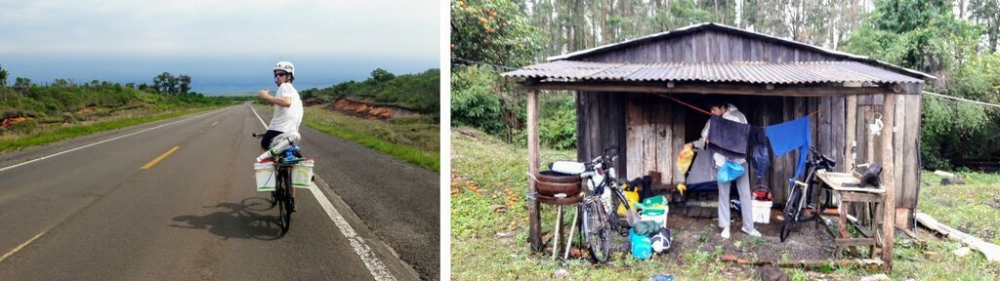

[< Rota, Equipamento, Fotos, Vídeo](https://darenhart.github.io/patagonia-trip)

# Viagem de bicicleta à Patagônia

por daniel werle arenhart

Por volta de dois anos e meio depois de ter voltado, decidi passar a limpo e reviver os manuscritos da caderneta de viagem.

São relatos de uma viagem de bicicleta saindo de Estrela/RS - Brasil até a Patagônia no verão de 2017-2018.

## Sumário

- [Sobre a viagem](#pre-viagem)
    - [Motivação](#motivacao)
    - [Quando, onde?](#quando-onde)
    - [Equipamento](#equipamento)
    - [Riscos](#riscos)
- [A Viagem](#a-viagem)
    - [Rio Grande do Sul](#rio-grande-do-sul)
    - [Uruguai](#uruguai)
    - [Argentina](#argentina---entre-rios)
        - [Entre Rios](#argentina---entre-rios)
        - Santa Fé e Laguna Miramar
        - Sierras Chicas de Cordoba
        - Los Gigantes e Los Tuneles
        - San Luis
        - Provincia Mendoza
        - Neuquén, norte da Patagônia
    - Chile
    - em breve...

## Sobre a viagem

### Objetivo

Viajar de bicicleta

### Motivação

A motivação surgiu de viagens menores de bicicleta feitas anteriormente.

Citações:

> “Todo sonho é uma derrota em potencial. Para não o realizar, basta manter-se parado” Argus Saturnino

> “A liberdade reside nas coisas simples" Antonio Olinto

> "Quando a gente tá contente, Tanto faz o quente, Tanto faz o frio" Gal Costa

Arte do auto escracho

### Quando e onde?

Tudo começou com uma grande vontade de fazer uma longa viagem de bicicleta.
Escolhi o destino Patagônia e a medida que a ideia foi amadurecendo, fui conversando com as pessoas sobre o assunto.
Sabia que esfriava bastante no sul portanto o objetivo era sair antes do início do verão seguinte. 
A saída se deu por volta de um ano e meio depois da concepção da ideia.
Não estava preso a uma [rota](https://darenhart.github.io/patagonia-trip), mas a que fazia mais sentido era seguir a sul próximo a cordilheira dos Andes e depois talvez voltar de carona.
Ainda não sabia quanto tempo levaria, mas seria menos de um ano.
A viagem ocorreu em quatro meses, de outubro de 2017 à Fevereiro de 2018. 

### Equipamentos

Ao descobrir que existe o termo cicloturismo, acabei encontrando pessoas que são referências no assunto, como por exemplo o [Olinto e a Rafaela]() e os [Pedarilhos]().
Escolhi e montei peça por peça da bicicleta para entender bem a mecânica, mas mal eu sabia que na viagem não precisaria nada mais além de passar óleo na correia, remendar câmara e trocar cabos.
Para começar a viajar de bicicleta não é preciso se preparar muito, mas aproveitei que estava no conforto de casa para revisar todo equipamento, e então evitar ter que resolver algo na estrada.
Me diverti escolhendo estrategicamente cada um dos itens que levaria buscando leveza, simplicidade, conforto e independência, nada muito diferente caso fosse uma viagem para Lua.

Existem roupas adequadas para o frio a preços acessíveis que dão vantagens em relação às roupas comuns.

Faca vc mesmo, tenho muito orgulho
Baldes - simbulo
Orgulho

supera qualquer alforge

falar dos outros equipamentos (roupas, barraca,cozinha, BALDES!...)

 [Veja mais](https://darenhart.github.io/patagonia-trip/#/gear)

### Riscos

Identifiquei alguns riscos que poderiam surgir durante a viagem e refleti sobre como evitá-los:

Roubo: Não é um risco vital, não dei muita importância, mas evitar capitais já é suficiente.

Ficar sem água: Sempre levei água extra para cozinhar, cuidar da higiene e lavar louça..... melhorar......portanto caso faltasse, abriria mão destes luxos. Houve poucos trajetos longos onde não houvesse motoristas para quem poderia pedir ajuda. 

Ser atropelado: Evitar capitais e estradas mais movimentadas. A Argentina e Chile no geral tem menos trânsito que no Brasil.

Perder o cartão e dinheiro: Não é um risco vital, não me preocupou muito, mas tentei separar as coisas em mais de um lugar.

## A viagem

### Rio Grande do Sul

#### Dia 1 - 13/10/2017

A presença, o bom humor e o apoio das pessoas foi muito importante no dia da saída para começar a viagem. Meu irmão Rafael (Fafa) e meus amigos Matheus Bechert e Adriano (Tinanço) me acompanharam.

Uma chuva leve nos acompanhou durante o dia, principalmente quando saímos. Depois de nos afastar da cidade, quebrou o bagageiro do Fafa, mas logo em seguida encontramos um senhor em uma pequena oficina que o concertou. Ele não queria cobrar nada mas demos a ele uns reais. Ficamos num camping no interior do município de Sério.

Apesar de todo peso sendo carregado, a sensação ao iniciar uma viagem de bike é de extrema leveza ao deslizar suavemente sobre o chão, levando tudo que se precisa para viver com independência e em condições diversas.

#### Dia 2

Visitamos um paredão em uma propriedade particular no arroio Sampaio. 

O Bechert e o Tinanço retornaram para suas casas. Fiquei feliz por eles terem saído junto. Seguimos em viagem eu e o Fafa em direção à Santa Maria, mas sem muita certeza de qual rota pegar. Além disso ainda não tínhamos onde pernoitar, então o Fafa fez uma ligação para o nosso amigo Matheus (Zhen) de Venâncio Aires que nos recebeu super bem. Fomos junto no aniversário do tio dele.

#### Dia 3

O sol começa a aparecer depois de dias com céu nublado. Chegando na cidade de Candelária, casualmente encontramos o Rainão, tio de um amigo nosso, que nos convidou para almoçar em sua casa e bater um papo. Eu nem sabia que ele morava em Candelária, então foi uma surpresa. Nos recomendaram pernoitar num parque de exposições onde tem água, luz e chuveiro. Estamos começando a nos adaptar melhor ao ritmo da nossa pedalada em dupla.

#### Dia 4 

Em Agudo. Ficamos num balneário inativo com acesso a uma cachoeira. Não tinha ninguém. Vimos bugios. 

#### Dia 5

Em Santa Maria, tivemos uma entrada tranquila na cidade, sem muito trânsito. Combinamos com nosso amigo estrelense Herinque (Ique) de nos encontrar na UFSM. Ficamos no seu quarto numa casa de estudante. Um alívio ter onde ficar numa cidade grande sem precisar ir atrás de hotel ou *Warmshower* (rede solidária de hospedagem). Agora o rumo era cruzar o Pampa até o Uruguai.

#### Dia 6

No final do dia em algum ponto entre Santa Maria e Rosário do Sul, conversamos com uns homens, em uma mecânica de ônibus, que nos cederam uma cabana onde passamos a noite. Nos convidaram para um mate e mais tarde eles nos ofereceram a janta. Na madrugada foi difícil dormir pois começou uma tempestade que fazia o chão tremer. A localidade se chamava "Cochilha do Pau Fincado"

#### Dia 7

Rosário do sul

Vento contra. Devido ao temporal no dia anterior, não tinha luz nem água em vários estabelecimentos, o que dificultou para nos reabastecer. Ficamos em uma cabana.

#### Dia 8

Santana do Livramento

Estragou a rosca do parafuso que segura o canote do banco. Para poder seguir viagem peguei uma braçadeira que tinha no meu kit *MacGyver* e fixei a altura dele, porém ainda ficava girando, mas já era melhor que pedalar em pé. Estava escurecendo quando chegamos. Ficamos no Hotel Estrela Palace. 

#### Dia 9

Rivera - Dia de Descanso. 

Arrumamos o canote numa loja de bicicleta, e não aceitaram pagamento. Fomos nos *free shops* e no caminho muitas pessoas vinham conversar com a gente. Um cara que gritava "Imprensa!" veio fazer uma entrevista para o jornal dele.  Um uruguaio nos convidou para ficarmos na sua casa. Anotamos o endereço depois o encontramos em casa. O Yony, como se chamava, conversava muito e se mostrava atencioso perguntando se não faltava nada. Fomos muito bem acolhidos. 

#### Dia 10

O pneu da minha bike estava com um furo minúsculo que só conseguimos encontrar depois que o Fafa afundou a câmara numa pia na rodoviária. Me despedi do Fafa que acompanhou toda travessia do pampa gaúcho.

Agora, sozinho, me dou conta que finalmente estou tornando um sonho em realidade. Me sinto um pouco ansioso mas muito paciente.

Logo mais estarei saindo do Brasil e entrando em terras desconhecidas. Me sinto cheio de energia para encarar o que vier pela frente. 

As cochilhas do pampa gaúcho vão ficando mais longas e menos íngremes até se tornarem uma planície. Árvores passam a ser mais raras. Essas mudanças são observadas muito lentamente ao longo de vários dias. Este para-lama transparente que emendei na roda dianteira não resistiu mais muitos dias.

O dia estava ótimo para pedalar: clima bom, estrada pouco movimentada, acostamento bom e nuvens bonitas. 

Vejo os cata-ventos e não perco a oportunidade de interpretar Dom Quixote.

Apanhei no chão um pedaço de placa de carro "RS - Uruguaiana".

Fiz acampamento selvagem.

[Mais fotos do trecho no Rio Grande do Sul](https://photos.app.goo.gl/VEyPE5sNytQAnLxJ3)

### Uruguai

#### Dia 11

Dia bom. Cruzei a fronteira para o Uruguai na cidade de Artigas e cheguei cedo. Uma senhora bem querida me recebeu no centro de informações turísticas. Disse que o *camping* aberto da praça era perigoso portanto fui para um *camping* no final da cidade. Ganhei um *chip* de celular num bazar.

#### Dia 12 

Fiz 100km sem muita dificuldade, talvez por causa do vento a favor. Os uruguaios que encontrava pelo caminho normalmente me cumprimentavam simpáticos. Visualizo da rua um conjunto de árvores agradável para acampamento e não perco a oportunidade. 

#### Dia 13

Depois de passar por alguns povoados, fui perguntar para as pessoas por lugares que pudesse *armar la carpa*. O policial disse que só tinha campo, uns rapazes me sugeriram um lugar embaixo de uma ponte. Não me atraí pela sugestão, segui pedalando e o que me sobrou foi uma plantação de eucaliptos onde não chamaria atenção. Normalmente pulava a cerca e deixava a bici presa do lado de fora. Neste dia podia andar, porém precisava descansar.

Vi um tatu bebê, um graxaim-do-campo caçando e muitas cutias (roedor gordinho). À noite sou contemplado com uma enorme quantidade de vaga-lumes no campo, algo que nunca tinha visto antes.

Nos pequenos povoados por onde passei, as casas são pequenas e simples, não vi mercados ou lojas com fachadas chamativas.

#### Dia 14

Em Salto conheci o Gianfranco e a Lidka pela plataforma de hospedagem solidária *Warmshowers*. 

Passei pela cidade, visitei o zoológico e as praças. 

#### Dia 15

A barca para cruzar o Rio Uruguai não saiu hoje devido ao tempo ruim, e o Gianfranco disse para eu ficar mais um dia. Acompanhei eles até o local onde confeccionam móveis artesanais. A casa foi construída com madeira e isopor por eles, e não usam a rede elétrica, apenas placas solares. Eles falam polonês, e o Gianfranco um pouco de português também.

[Mais fotos do trecho no Uruguai](https://photos.app.goo.gl/2usGhXWPM3wV8BEh1)

### Argentina - Entre Rios

#### Dia 16 - 28/10/2017

Novamente acordei cedo para tentar pegar a barca. Consultei alguns funcionários mas ninguém sabia exatamente onde nem quando ele saía. Para me deixar mais desinformado, quando ouvia a palavra *viernes* (sexta-feira), deduzia que significava inverno. Enfim, nem cheguei a ver a barca então fui até o terminal de ônibus onde casualmente estava para sair um. Tirei os baldes (alforges), a roda da frente e larguei tudo no bagageiro.  O ônibus cruza o rio por uma barragem em alguns minutos. Registrei passagem na aduana Argentina. 

Em Concórdia, fui na loja da Claro para fazer um novo *chip* de celular. Saindo da loja, no meio de muita gente chega um pai andando com sua família e me cumprimenta, dizendo que também andava de bike. Depois se aproxima para dar um beijo de bochecha e o resto da família também me cumprimenta da mesma forma. Estavam juntas a mãe e duas filhas, todos sorridentes. Aquilo fez meu dia mais alegre. Só mais tarde descobri que este é um cumprimento comum na argentina. Dei uma volta pela cidade, troquei pesos com um cidadão, depois me fui em direção ao povoado de General Campos. 

Na maioria do caminho tinha uma faixa bloqueada, devido à obras, que estava como um ciclovia gigante perfeita pra andar de bici. Foi uma maravilha. Na entrada da cidade, um pedalante local me acompanhou e mostrou uma praça onde eu podia ficar. No mercado, um senhor me sugeriu avisar a polícia que ficaria por ali e assim o fiz. Chegando na praça, apareceu um adolescente de bike que tinha umas conversas um pouco estranhas. Ele dizia ter viajado pelo japão mas era visível que estava inventando. Para ele sair da minha cola acabei o ignorando pois precisava armar acampamento, cozinhar e descansar. 

Fui até a praça central e vi o final de uma cerimônia de casamento. Voltando para a praça onde tinha armado a barraca, apareceram uns adolescentes com som alto no carro, logo já desarmei a barraca e movi para outro canto. Ali conheci o Lizandro, um professor de música bem jovem, e um amigo dele. Haviam sido avisados que eu estava ali pelos pais de um deles com quem havia conversado logo que cheguei. Lizandro tocou umas musicas com seu violão e seu amigo fazia segunda voz. Uma das coisas que buscava na viagem era ouvir a música local, mas não imaginava que seria no primeiro dia na Argentina, nem que ela viria até mim. Que coisa boa ouvir uma canção castelhana de alguém com idioma nativo. Me sugeriram conhecer a localidade de San Marcos Sierras.

#### Dia 17

Domingo. Na mesma praça, fui convidado para um assado num aniversário! Era um grupo de amigos motociclistas. Eles vinham conversar e tirar foto comigo. Ganhei carona até Bovril. A Graciela me ofereceu carona. Uma professora que pegava carona na estrada para dar aula, algo bem comum por ali. Tava com dificuldade de entender pra onde ela ia me levar. Só quando descobri que B tem som de V daí consegui achar Bovril no mapa. Saía um pouco do meu percurso, mas já evitava uma estrada um pouco mais movimentada do que o normal. Já escuro, avisei a polícia de Bovril, e eles me indicaram um *camping*. Não tinha ninguém lá mas fui entrando, afinal tinha a permissão da polícia. Ao sair do banheiro depois de um ótimo banho, estava ali um cara perguntando o que eu estava fazendo ali, expliquei a minha situação e ele disse para eu sair cedo no dia seguinte.

#### Dia 18

Andei 100km, cheguei cedo e não muito cansado, parece que estou criando resistência. Eu vinha acompanhando o blog dos Pedarilhos pois faria um trajeto semelhante ao deles. Nesse dia queria parar no Parque Rural Enrique Berduc, um lindo *camping free*! Pelo menos naquele dia. Este parque se encontra dentro do Parque Nacional San Martin, um terreno que foi doado com a condição de que fosse um Parque Nacional.

Uma imagem muito confortante aos olhos de um cicloviajante:

<!--

### Argentina - Santa Fé e Laguna Miramar

#### Dia 19

São Tomé - Fui até o município de Paraná na entrada do túnel. Um supervisor me levou numa caminhonete até o outro lado do túnel. Dei umas voltas pela cidade até encontrar um óculos EPI escuro. Esse é o terceiro que tenho. Em Santa Fé também queria trocar uns reais por pesos. Esperei até abrir depois das 16:30 e o cambio não abriu. Fui para o camping municipal..25 pesos.   *falar dos campings municipais* 

#### Dia 20

Sá Pereira. Voltei até Santa Fé para trocar reais e pediram o passaporte... começando o dia andando 15km em vão. Voltei para buscar, tinha um vento lateral a favor. Estrada boa. Fiquei nos bombeiros, deram janta, fomos buscar.  

#### Dia 21

Colonia Cello

Esperei nos bombeiros até parar a chuva. Estrada boa, vento favorável. Cheguei na policia, não tinha ninguém, o visinho começou a conversar e logo já ofereceu a casa. Gaston, Sofia e a filha Anita. Sofia Tocou umas músicas argentinas - zamba carpera, chamamé, carnavalito, Gato, chacarera. A praça é quase maior que a cidade. Tinha gravado as músicas que ela tocou, mas perdi.

#### Dia 22

La Paquita

Por muitoa sorte no dia que eu mudo de direção, o vento muda também a meu favor. Passo por San Francisco, alguém passando de carro grita de longe  "dónde es?".

Um motorista faz sinal para eu parar e me oferece uma pizza! Já tinham parado no meio do pampa gaucho  pra dar umas laranjas e bergamotas, mas uma pizza quentinha!!?

Em La Paquita a policia indica um estabelecimento tipo CTG para pernoitar. Uma pessoa convida para um mate na manhã seguinte e também para um aniversário de um bebê de 1 ano.

#### Dia 23

Miramar - Laguna mar Chiquita

Vejo muitos pássaros atravessando a rua voando toda a manhã. Chegando em Miramar, passo pelo hotel abandonado Viena, fico num camping próximo. Vejo Flamingos de longe.

#### Dia 24

La Para

Vou até outro ponto próximo da laguna em um camping. Um grupo de homens argentinos me convidam para se juntar e oferecem assado.

### Argentina - Sierras Chicas de Cordoba

Em breve...

### Argentina - Los Gigantes e Los Tuneles

Em breve...

Cansei de ficar se preocupando no que postar nas redes e decidi aproveitar o agora 

Dica preciosa: Cagar de manha

Foto de flor com andes no fundo

Estar fazendo algo muito diferente fez acessar memórias do subconciente

-->

-----

<footer>
[Rota](https://drive.google.com/open?id=1_JDlbahMjzcIFIkYdwVplNBTrXXGvek3&usp=sharing) 
[Equipamento](https://darenhart.github.io/patagonia-trip/#/gear) 
[Galeria](https://darenhart.github.io/patagonia-trip/#/gallery) 
[Vídeo](https://www.youtube.com/watch?v=MPgr4FjIZF8) 
[Alguns números](https://docs.google.com/spreadsheets/d/1h_DqRs4x_f9nJ4AM-QcrCmykR1IXHAM8ZEvonXcv-Zw/edit#gid=1891380202) 
[Github](https://github.com/darenhart/patagonia-journal) 

</footer>
