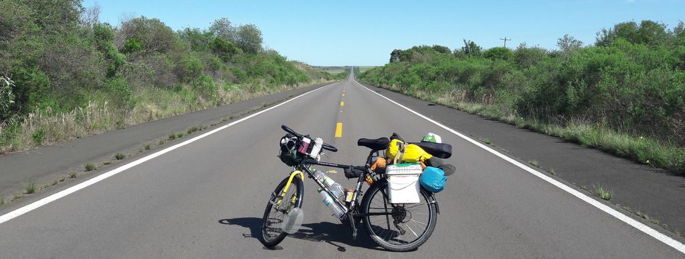

[< Rota, Equipamento, Fotos, Vídeo](https://darenhart.github.io/patagonia-trip)

# Viagem de bicicleta à Patagônia

## Sumário

[Pré Viagem](pre-viagem)

​	[Motivação](motivacao)

​	[Quando](quando)

​	[Equipamento](equipamento)

​	[Riscos](riscos)

[A Viagem](a-viagem)

​	[Rio Grande do Sul](rio-grande-do-sul)

​		[Dia 1](#dia-1) ... [Dia 6](#dia-6)

​	[Uruguai](#uruguai)

​		[Dia 7](#dia-7) ... [Dia 20](#dia-20)

​	[Argentina](#argentina)

​		[Dia 7](#dia-7) ... [Dia 20](#dia-20)

## Pré Viagem

### Motivação

> “Todo sonho é uma derrota em potencial. Para não o realizar, basta manter-se parado” Argus Saturnino

> “A liberdade reside nas coisas simples" Antonio Olinto

> "Quando a gente tá contente, Tanto faz o quente, Tanto faz o frio" Gal Costa

anciedade diminui com mais incertezas

### Quando

A decisão foi um processo lento.

1 ano e 5 meses antes, decidi que iria algum momento fazer uma viagem grande pela america do sul.

1 ano e 4 meses antes, comecei a contar para as pessoas próximas mas sem certeza.

1 ano e 3 meses antes, decidi que sairia do trabalho em +- 1 ano e viajaria por +- 1 ano.

### Equipamento

1 ano antes comprei o quadro Trek 930 da bicicleta que eu iria montar para a viagem. Escolhi e montei peça por peça para entender bem a mecânica, mal eu sabia que na viagem não iria precisar nada mais que passar oleo na correia, remendar camara e trocar cabos.

### Riscos

roubo

ficar sem água:  Ver no mapa uma cidade a 100 km, e depois descobrir que são 100km de areia fofa.

perder cartão e dinheiro

ser atropelado

se acidentar e perder a locomoção longe de uma cidade

qual a fração de dias que passaria por uma estrada não movimentada?

## A Viagem

### Rio Grande do Sul

Dia 0

#### Dia 1 - 13/10/2017

Família Arenhart toda chegou na despedida.

Quebrou bagageiro do fafa. Concertamos em um mecânico. Ele não queria cobrar nada mas demos 10 reais.

Fafa Bechert e Tinanço acompanharam

Choveu durante a saída e um pouco no resto do dia.

Fazem 3 semanas que saí para uma viagem rumo à patagônia em bicicleta. Ainda estou absorvendo o que vem acontecendo.
Apesar de todo peso sendo carregado (uns 32 kilos com a bike), a sensação ao iniciar uma viagem de bike é de extrema leveza ao deslizar suavemente sobre o chão levando tudo que se precisa para viver com independência em condições diversas.
Valeu Fafa, Bechert e Tinanço por me acompanharem uns dias!
Farei alguns relatos para quem tem interesse em acompanhar, mas nem sempre serão do local que estou no momento devido a tempo e sinal de internet.

#### Dia 2

Visitamos o paredão

Despedimos do Bechert e Tinanço. Dormimos no Zehn. Fomos no niver do tio dele. Um pouco desmotivado por não ter decidido o caminho nos próximos dias.

#### Dia 3

Candelária

Sol :) Encontramos o Rainão. Domingo tudo fechado. Nos recomendaram um parque de exposições onde tem energia, chuveiro e guardinha. Percebendo como é pedalar em dupla com o Fafa.

#### Dia 4 

Agudo. Ficamos num balneário inativo. Não tinha ninguém. Bugios

#### Dia 5

Santa Maria

Não tinha tanto movimento para entrar na cidade. Encontramos o Ique na UFSM depois na casa dele.

#### Dia 6

Cochilha do Pau Fincado

No final do dia entre Santa Maria e Rosário do Sul, conversamos com uns homens, em uma mecânica de ônibus, que nos cederam uma cabana onde pudemos passar a noite. Nos convidaram para um mate e mais tarde eles nos ofereceram a janta. Na madrugada foi difícil dormir pois começou uma tempestade que fazia o chão tremer. No dia seguinte, chegando em Rosário faltava luz e água em vários estabelecimentos, o que dificultou para nos reabastecer.

#### Dia 7

Rosário do sul

Vento contra. Ficamos em uma cabana. 45 reais por pessoa. Não tinha luz nem água em vários lugares devido ao temporal.

#### Dia 8

Santana do Livramento 110km

Chegamos escurecendo. Hotel estrela palace. Estragou a rosca da abraçadeira do canote.

#### Dia 9

Descanso

Fomos nos free shops.

Acabamos conversando com muitos no caminho. Um cara que gritava "Imprensa!" veio fazer uma entrevista para o jornal dele. Um uruguaio convidou para ficarmos na casa dele. Anotamos o endereço depois encontramos ele em casa. Ele conversava muito e perguntava se não faltava nada. Furou o pneu. Um furo minúsculo que só descobrimos no dia seguinte quando o fafa levou a camara numa pia no banheiro da rodoviária. Arrumamos o suporte de do canote provisoriamente. Na biciclo. Não cobraram nada.

#### Dia 10

Despedida do Fafa. Acampei 50km antes de quaraí - selvagem

Depois de ter sido muito bem acolido pelo uruguaio Yony que nos convidou para ficar em seu quiosque em Rivera, me despedi do Fafa que acompanhou toda travessia do pampa gaúcho. Sigo a viagem solo até que encontre no caminho alguém fazendo um trajeto próximo ao meu.

Dia ótimo, clima bom, estrada pouco movimentada, acostamento bom, núvens bonitas.

As cochilhas do pampa gaúcho vão ficando mais longas e menos íngremes até se tornarem planície na Argentina. Árvores passam a ser menos frequêntes. Essas mudanças são observadas muito lentamente ao longo de uns 900km e vários dias.

Este paralama transparente na roda dianteira não resistiu

### Uruguai

#### Dia 11

Artigas - Uruguai

Dia bom. Cheguei cedo. Uma senhora do turismo me recebeu. Bem querida, disse que o camping perto no inicio da cidade era pericoso. Fiquei num camping no final da cidade. Ganhei um chip de celular.

#### Dia 12 

Vento a favor. 100km Uruguaios legais. Comprimentavam. Pulei uma cerca e fiquei num bosque bonito.

Pelo interior do Uruguai, visualizo da rua um conjunto de árvores agradável para acampamento e não perco a oportunidade. 

#### Dia 13

Passei por mais uns povoados. Perguntei por lugares para armar la carpa. Policial disse que só tem campo, uns rapazes me sugeriram um lugar embaixo de uma ponte (acho que arranjo algo melhor). Não gostei e fui até uns eucaliptos. Pulei a cerca. 

Nos pequenos povoados que passei, as casas são pequenas e simples, não vi mercados ou lojas com fachadas chamativas.

Neste dia podia andar mais porém era preciso descansar. Vi um tatu bebê, um graxaim caçando e muitas cutias (roedor gordinho). À noite sou presenteado com muitos vagalumes no campo.

#### Dia 14

Salta - warmshower - Gianfranco

Zoo, praças. Passeei pela cidade

#### Dia 15

Salta - descanso

A barca não saiu hoje devido ao tempo ruim. Fiquei na casa do casal. Falam polonês. Fizeram a própria casa. Não usam a rede elétrica, apenas placas solares.

### Argentina - Entre Rios

#### Dia 16 - 28/10/2017

Novamente acordei cedo para tentar pegar a barca mas de novo não saiu. Parece que ninguêm sabia o certo. Fui até o terminal de bue e cheguei bem no horário certo. Estava saindo um para concordia. Tirei os baldes, a roda da frente e enfiei tudo no bagageiro. Registrei na aduana Argentina. Fui na loja da claro, fiz um chip novo. Saindo da loja no meio de muita gente chega um pai de familia e comprimenta, dizendo que andava de bike. Depois se aproxima para dar um beijo de bochecha. O resto da familia também comprimenta da mesma forma. Esposa e duas filhas, todos gordinhos e sorridentes. Aquilo fez meu dia mais alegre. Só mais tarde descobri que este é um cumprimento comum na argentina. Passei um pouco por concordia e me fui em direção ao povoado de General Campos. Na maioria do caminho tinha uma faixa bloqueada devido a obras. mas estava perfeita pra andar de bici, era como uma ciclovia gigante. Foi uma maravilha. Na entrada da cidade um pedalante local me acompanhou e me mostrou onde eu podia ficar: um parque publico. No mercado um nativo disse que devia avisar a policia. Assim o fiz. Fui para a praça/parque, e um garoto de bike um pouco estranho começou a conversar comigo e não saía da minha cola. Fui até a praça central e vi o final de uma cerimônia de casamento. 

Voltando para o parque, apareceram uns guris com som alto no carro, desarmei a barraca que já tinha armado e movi para outro canto. Nisso apareceram dois guris, um com um violão. Musicos - que paso. (me falaram sobre san marcos sierras)

#### Dia 17

Domingo. Fui convidado para um assado! Era um grupo de amigos de moto. Todos vieram conversar e queriam tirar foto comigo. Guanhei carona até Bovril. Uma professora que pegava carona para dar aula. Tava com dificuldade de entender pra onde ela ia me lever. Só quando descobri que B tem som de V daí consegui achar Bovril no mapa. Avisei a policia, fiquei num camping, para minha surpresa chegou um cara e disse que não podia. Me mando bem cedo.

#### Dia 18

Paraná - parque enquique Berduc. Andei 100km. Cheguei cedo e não muito cansado, parece que estou criando resistência. Camping free muito lindo! (acompanhava o blog dos Pedarilhos)

#### Dia 19

São Tomé - Fui até Paraná na entrada do tunel. Um supervisor me levou numa caminhonete até o outro lado do túnel. Dei umas voltas até conseguir um oculos EPI escuro. Esse é o teceiro que tenho. Em santa fé também queria trocar uns reais por pesos. Esperei até abrir depois das 16:30 e o cambio não abriu. Fui para o camping municipal..25 pesos.   *falar dos campings municipais* 

#### Dia 20

Sá Pereira. Voltei até Santa Fé para trocar reais e pediram o passaporte... começando o dia andando 15km em vão. Voltei para buscar, tinha um vento lateral a favor. Estrada boa. Fiquei nos bombeiros, deram janta, fomos buscar.  

#### Dia 21

Colonia Cello

Esperei nos bombeiros até parar a chuva. Estrada boa, vento favorável. Cheguei na policia, não tinha ninguém, o visinho começou a conversar e logo já ofereceu a casa. Gaston, Sofia e a filha Anita. Sofia Tocou umas músicas argentinas - zamba carpera, chamamé, carnavalito, Gato, chacarera. A praça é quase maior que a cidade. Tinha gravado as músicas que ela tocou, mas perdi.

#### Dia 22

La Paquita

Por muitoa sorte no dia que eu mudo de direção, o vento muda também a meu favor. Passo por San Francisco, alguém passando de carro grita de longe  "dónde es?".

Um motorista faz sinal para eu parar e me oferece uma pizza! Já tinham parado no meio do pampa gaucho  pra dar umas laranjas e bergamotas, mas uma pizza quentinha!!?

Em La Paquita a policia indica um estabelecimento tipo CTG para pernoitar. Uma pessoa convida para um mate na manhã seguinte e também para um niver de um bebê de 1 ano.

#### Dia 23

Miramar - Laguna mar Chiquita

Vejo muitos pássaros atravessando a rua voando toda a manhã. Chegando em Miramar, passo pelo hotel abandonado Viena, fico num camping próximo. Vejo Flamingos de longe.

#### Dia 24

La Para

Vou até outro ponto próximo da laguna em um camping. Um grupo de homens argentinos me convidam para se juntar e oferecem assado.

