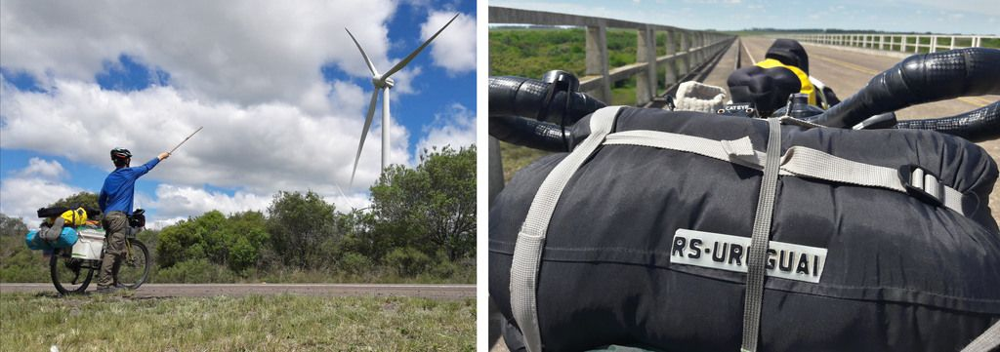

## A viagem

### Rio Grande do Sul

#### Dia 1 - 13/10/2017

A presença, o bom humor e o apoio das pessoas foi muito importante no dia da saída para começar a viagem.
Meu irmão Rafael (Fafa) e meus amigos Matheus Bechert e Adriano (Tinanço) me acompanharam.

Uma chuva leve nos acompanhou durante o dia, principalmente quando saímos. 
Depois de nos afastar da cidade, quebrou o bagageiro do Fafa, mas logo em seguida encontramos um senhor em uma pequena oficina que o concertou.
Ele não queria cobrar nada mas demos a ele uns reais.
Ficamos num camping no interior do município de Sério.

Apesar de todo peso sendo carregado, a sensação ao iniciar uma viagem de bike é de extrema leveza ao deslizar suavemente sobre o chão, levando tudo que se precisa para viver com autossuficiência e em condições diversas.

#### Dia 2

Visitamos um paredão em uma propriedade particular no arroio Sampaio. 

O Bechert e o Tinanço retornaram para suas casas.
Fiquei feliz por eles terem saído junto.
Seguimos em viagem eu e o Fafa em direção à Santa Maria, mas sem muita certeza de qual rota pegar.
Além disso ainda não tínhamos onde pernoitar, então o Fafa fez uma ligação para o nosso amigo Matheus (Zhen) de Venâncio Aires que nos recebeu super bem.
Fomos junto no aniversário do tio dele.

#### Dia 3

O sol começa a aparecer depois de dias com céu nublado.
Chegando na cidade de Candelária, casualmente encontramos o Rainão, tio de um amigo nosso, que nos convidou para almoçar em sua casa e bater um papo.
Eu nem sabia que ele morava em Candelária, então foi uma surpresa.
Nos recomendaram pernoitar num parque de exposições onde tem água, luz e chuveiro.
Estamos começando a nos adaptar melhor ao ritmo da nossa pedalada em dupla.

#### Dia 4 

Em Agudo ficamos num balneário inativo com acesso a uma cachoeira.
Não tinha ninguém.
Vimos bugios. 

#### Dia 5

Em Santa Maria, tivemos uma entrada tranquila na cidade, sem muito trânsito.
Combinamos com nosso amigo estrelense Herinque (Ique) de nos encontrar na UFSM.
Ficamos no seu quarto numa casa de estudante.
Um alívio ter onde ficar numa cidade grande sem precisar ir atrás de hotel ou *Warmshower* (rede solidária de hospedagem).
Agora o rumo era cruzar o Pampa até o Uruguai.

#### Dia 6

No final do dia em algum ponto entre Santa Maria e Rosário do Sul, conversamos com uns homens, em uma mecânica de ônibus, que nos cederam uma cabana onde passamos a noite.
Nos convidaram para um mate e mais tarde eles nos ofereceram a janta.
Na madrugada foi difícil dormir pois começou uma tempestade que fazia o chão tremer.
A localidade se chamava "Cochilha do Pau Fincado"

#### Dia 7

Pegamos vento contra durante o dia.
Em Rosário do sul, devido ao temporal no dia anterior, não tinha luz nem água em vários estabelecimentos, o que dificultou para nos reabastecer.
Alugamos uma cabana.

#### Dia 8

Estragou a rosca do parafuso que segura o canote do banco.
Para poder seguir viagem peguei uma braçadeira que tinha no meu kit *MacGyver* e fixei a altura dele, porém ainda ficava girando, mas já era melhor que pedalar em pé. Estava escurecendo quando chegamos em Santana do Livramento.
Ficamos no Hotel Estrela Palace (sim, tem exatamente o mesmo nome do hotel de Estrela, minha cidade natal).

#### Dia 9

Arrumamos o canote numa loja de bicicleta, e não aceitaram pagamento.
Junto de Santana do Livramento está a cidade uruguaia Riveira, e é muito interessante como a cultura está misturada.
Fomos nos *free shops* e no caminho muitas pessoas vinham conversar com a gente.
Um cara que gritava "Imprensa!" veio fazer uma entrevista para o jornal dele.

Um uruguaio nos convidou para ficarmos na sua casa.
Anotamos o endereço, depois o encontramos em casa.
O Yony, como se chamava, conversava muito e se mostrava atencioso perguntando se não faltava nada.
Fomos muito bem acolhidos.

#### Dia 10

O pneu da minha bike estava com um furo minúsculo que só conseguimos encontrar depois que o Fafa afundou a câmara numa pia na rodoviária.
Me despedi do Fafa que acompanhou toda travessia do pampa gaúcho.

Agora, sozinho, me dou conta que estou tornando um sonho em realidade.
Me sinto um pouco ansioso mas muito paciente.

Logo mais estarei saindo do Brasil e entrando em terras desconhecidas.
Me sinto cheio de energia para viver o que vier pela frente.

As cochilhas do pampa gaúcho vão ficando mais longas e menos íngremes até se tornarem uma planície.
Árvores passam a ser mais raras e arbustos começam a tomar o lugar delas.
Essas mudanças são observadas muito lentamente ao longo de vários dias.
Este para-lama transparente que emendei na roda dianteira não resistiu mais muitos dias.

O dia estava ótimo para pedalar: clima bom, estrada pouco movimentada, acostamento bom e nuvens bonitas.
Vi os cata-ventos de energia eólica e me senti como um Dom Quixote moderno.
Apanhei no chão um pedaço de placa de carro "RS - Uruguaiana" casualmente perto de cruzar a fronteira.
Pulei a cerca e fiz acampamento selvagem entre as macegas.

[Mais fotos do trecho no Rio Grande do Sul](https://photos.app.goo.gl/VEyPE5sNytQAnLxJ3)