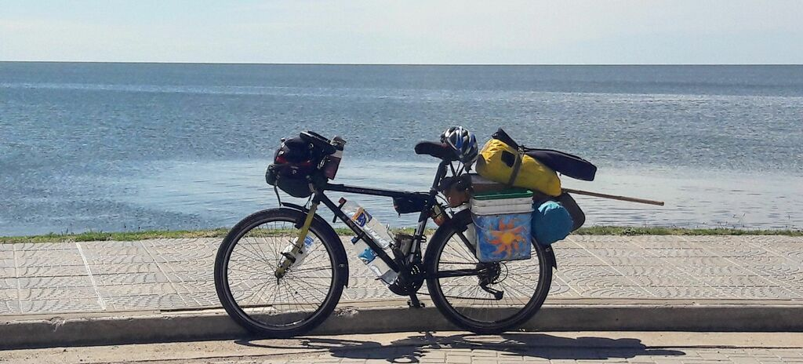

### Argentina - Santa Fé e Laguna Miramar

#### Dia 19 - 31/10/2017

Fui até o município de Paraná na entrada do túnel onde um supervisor me levou numa caminhonete até o outro lado do rio Paraná.
Acabei perdendo pela segunda vez os óculos EPI de sol, então dei umas voltas pela cidade até arranjar um novo.
Queria também trocar uns reais por pesos.
Esperei até o câmbio abrir depois das 16:30h conforme tinham me informado, mas não abriu.
Fui para o camping municipal de São Tomé, cidade vizinha.

#### Dia 20

Voltei até Santa Fé sem a bagagem para trocar reais no câmbio, porém pediram o passaporte, então tive que voltar para pegar.
Comecei o dia pedalando 15km em vão.
Segui até Sá Pereira.
Lá fiquei nos bombeiros onde fui muito bem recebido. 
Fomos buscar uma janta e eles não aceitaram meu pagamento.

#### Dia 21

Esperei nos bombeiros até parar a chuva.
Até aqui a primeira chuva desde o Rio Grande do sul, porém nem atrapalhou.
A estrada estava ótima, bem pouco movimento, vento favorável.
Parei em uma pequena cidade chamada Colonia Cello cuja praça é quase maior que a própria cidade.
Como de costume, fui na polícia, mas não tinha ninguém.
Havia uma missa terminando na igreja ao lado, provavelmente toda população estava lá, inclusive os policiais.
Um morador começou a conversar comigo e em poucos segundos já estava oferecendo pouso em sua casa.
Gaston, Sofía e a filha Anita são muito queridos.
Sofía toca violão e canta muito bem.
Ela me apresentou vários gêneros de músicas argentinas como zamba carpera, chamamé, carnavalito, gato e chacarera.
Sou muito agradecido por essa imersão de cultura através da música que tive.

#### Dia 22

Chego na Província de Córdoba na cidade de San Francisco.
Passando por uma rótula/rotatória, um motorista grita de longe "¿donde es?" e respondo ele nos poucos segundos até nos perdermos de vista.
Um outro motorista faz sinal para eu parar e me oferece um pedaço de pizza!
Já tinham me parado no meio do pampa gaúcho para dar umas laranjas e bergamotas, mas uma pizza quentinha perto do horário do almoço foi muito inesperado.

Por muita sorte no dia que eu mudo de direção na estrada, o vento também muda a meu favor. 
Farei um desvio para evitar a capital de Córdoba.
Em La Paquita um policial muito prestativo me levou até um local tipo um CTG onde pernoitei.
Uma pessoa no local convida para um *mate* na manhã seguinte e também para o aniversário de um bebê de 1 ano, porém decido que vou seguir.

#### Dia 23

Durante a manhã no caminho até Miramar vejo algumas centenas de pássaros atravessando a rua voando.
No centro do continente acabo então me deparando com um mar.
É a Laguna Mar Chiquita, tão grande que não se vê o fim no horizonte.
Vejo flamingos de longe.
Passo pelo hotel abandonado Vienna e fico num camping próximo.

#### Dia 24

Pedalo uns 40km até outro ponto próximo da laguna, onde paro num camping.
Como é domingo, acabo me juntando a um grupo de homens argentinos que estão fazendo um assado.

[Mais fotos do trecho Santa Fé e Laguna Miramar](https://photos.app.goo.gl/e0Ee62FGLjaVAHd53)

