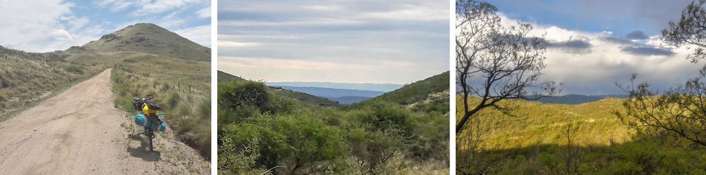

### Argentina - Sierras Chicas de Córdoba

#### Dia 25 - 06/11/2017

Com vento a favor na tarde, acabo pedalando bastante e passando por quatro povoados, porém senti leves dores no joelho e no punho.
Sinto que devo fazer um dia de descanso.
Em um dos vilarejos, uma criançada ainda com uniforme da escola, se aproxima para conversar.
Disseram que já passaram *viajeiros* de vários outros países.
Um garoto me levou até sua casa para buscar água e fez questão de ir junto me orientar para a saída da cidade.

Decido ficar em Cañada de Luque, então passo na polícia, mas não tinha ninguém.
Pessoas passando na rua apontam para uma loja onde dizem ter alguém que pode ajudar.
Na loja indicam à mim ir acampar atrás do museu.
Em pouco tempo e com pouco esforço já tenho um local para pernoitar graças à pré-disposição das pessoas.
Mas não um é local que me sinto confortável para passar um dia de descanso.

#### Dia 26

Esperei a chuva passar, fiz sanduiches e saí perto do meio dia.

Depois de quase um mês pedalando em pampas e planícies, vejo no horizonte as *Sierras de Córdoba*, o que dá muita motivação para seguir em frente apesar de precisar repousar.
Consultei a altimetria do trajeto e vi uma subida de 300m distribuida ao longo de 40km, apesar de parecer que ainda estava em uma planície.
Um aclive imperceptível aos olhos mas que dava a sensação de estar mais fraco ou do pneu estar murcho.
Certamente me confundiria caso não tivesse o dado da altimetria.

No meio do caminho vi que estava sem a tampa do balde-alforge e voltei até encontrá-la atirada no chão.
Em Villa del Totoral montei a barraca ao lado do rio.

#### Dia 27

Tinha ouvido falar que na Argentina as margens dos rios são públicas e é permitido acampar. 
Até que enfim um local perfeito para ficar um dia a mais.
Gramado com bastante espaço, algumas árvores, água cristalina vindo dos Andes, *parrillas*, pouquíssimo movimento e bem perto da cidade.

Aproveitei o dia fazendo com calma as refeições e apreciando o local.

#### Dia 28

A partir daqui tudo começa a mudar.
A estrada de rípio toma o lugar do asfalto tornando a paisagem menos antropizada.
Não sei se era por estar muitos dias na planície, mas fiquei maravilhado ao ver as montanhas das Sierras Chicas.
Começo a apreciar uma grande variação das paisagens, do clima, das núvens, da vegetação e dos cheiros.
Aquilo era diferente de tudo que já tinha visto e sentido, até demais para um só dia.
Depois ainda veio uma chuva, deixando o céu ainda mais colorido.

Passo pelas Cuevas de Ongamira, grutas que são verdadeiras esculturas naturais.
Queria ficar em algum camping pelo caminho, mas estavam fechados, então segui até San Marcos Sierras, município que o Lizandro de Entre Rios me indicou.

Cidade muito tranquila sem estradas asfaltadas, com um clima mais artístico e hippie.
As placas que nomeiam as ruas usam uma fonte cursiva.
Ao chegar no camping eu já estava seco.
Lá havia um violonista compondo uma música.

#### Dia 29

Pedalei somente 20km até Capilla del Monte, mas tinha muito morro para atravessar e peguei bastante sol.
O turismo lá é baseado em ovnis e alienígenas, e existem lendas relacionadas ao cerro Uritorco que se vê da cidade.
Fiquei no camping municipal, onde aproveitei para combinar uma hospedagem solidária do *Warmshower* na cidade de Tanti.

[Mais fotos do trecho nas Sierras Chicas de Córdoba](https://photos.app.goo.gl/ib1TcnAuwt5wkDQj1)

