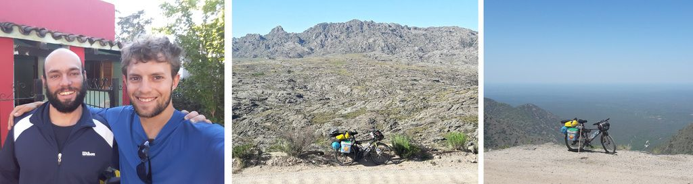

### Argentina - Los Gigantes e Los Tuneles

#### Dia 30 - 11/11/2017

Passei por várias cidades, numa delas vi desfiles de grupos tradicioinais.
Pousei num camping de Cosquín.

#### Dia 31

Cheguei cedo em Tanti e descansei numa sombra na beira do rio.
Muitos rios que passei tem a borda com pouca vegetação, permitindo fazer caminhada ou acampar.
Fiquei na casa do Franco que conheci no *Warmshowers*, ele me deu umas dicas sobre o caminho para visitar Los Gigantes.
Sugeriu ir conhecer a Sierra Grande de Cordoba.
Ele fazia questão de dormir numa maca de fisioterapia e me ceder seu quarto e sua cama.

#### Dia 32

Saí bem cedo da casa do Franco.
Subi os 1000m de estrada de chão.
Incrível como a paisagem fica mais bonita quando não tem cercas na divisa das estradas com os terrenos.
Esse era um tipo de local que desejava passar.
Nenhuma marca de humanos até o horizonte exceto a estrada.
Apesar de não ter sombra, não lembro de ter ficado com muito calor.
Vou cada vez chegando mais perto de Los Gigantes.
São montanhas praticamente sem vegetação, com bastante rocha aparente.
Impressionante, muito diferente do que estou acostumado a ver.

Havia um camping perto da montanha, mas estava mais afim de fazer acampamento selvagem.
O Franco havia sugerido um lugar perto do rio, achei perfeito.

#### Dia 33

Em Salsacate, o camping da cidade estava fechado.
Logo mais já iria escurecer, então comecei a observar possibilidades de pernoite na estrada.
Vi um campinho de futebol atrás de uma academia, consultei o proprietário e fiquei por ali mesmo.
Pude usar o chuveiro quente.

#### Dia 34

Tinha mais subida pela frente, mas o que dificultou foi a estrada de rípio com costelas de vaca (pequenas ondinhas de terra) e o vento contra.
Cheguei em Los Tuneles que se trata de uma série de túneis que foram feitos para descer a serra.
Lá de cima apenas se via uma planície sem fim com um horizonte tênue, que parecia mais um mar.

Aqui eu tinha duas opções.
Descer pelos túneis e seguir nessa imensa planície em uma estrada de chão que me levaria mais perto dos Andes.
Ou desviar ao sul para passar pela Sierra Grande.
Acabei optando pela segunda opção, conforme sugeriu o Franco, mas antes fui visitar pelo menos os dois primeiros túneis.

Ao meio dia parei num restaurante na beira da estrada, porém os preços não estávam nada razoáveis.
Ao sair, umas pessoas de uma mesa me chamam para sentar junto.
Um casal, uma filhinha e uma vovó.
O Max contou sua experiência acampando somente com saco de dormir ao ar livre num deserto em Mendoza.

Parei em Pocho, conversei com um policial, mas ele não sabia onde podia ficar.
Sugeriu falar com a cuidadora da igreja.
Passei na *despensa* (mercadinho) e a dona acabou ligando para a cuidadora e ela deixou acampar ao lado.

[Mais fotos do trecho Los Gigantes e Los Tuneles](https://photos.app.goo.gl/ulJhCRtg7yLOMdqE2)

