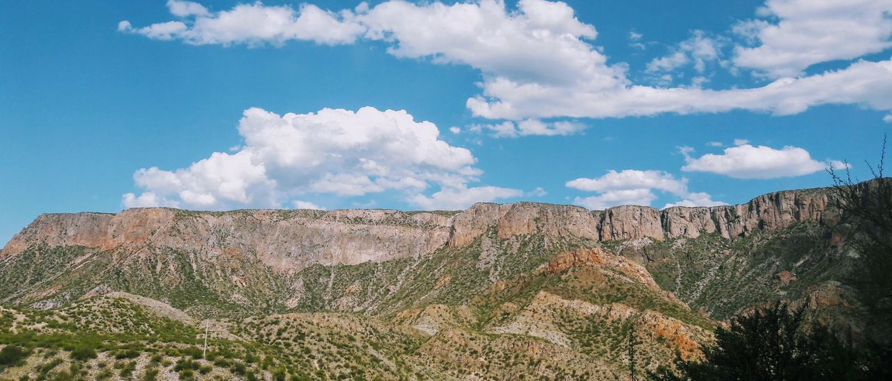
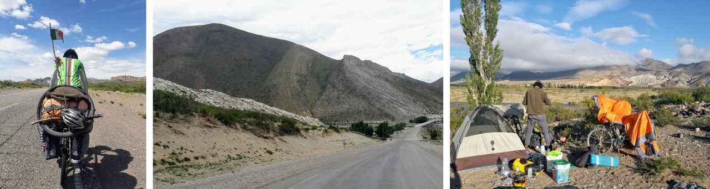

### Argentina - Provincia Mendoza

#### Dia 43 - 24/11/2017

O acampamento bivaque me adiantou bastante.
Comecei o dia pedalando com uma bela vista do sol nascendo e uma reta infinita pela frente.
Passei praticamente o dia todo em cima da bike, pois estar em movimento refrescava mais do que ficar ao sol.
A única sombra que encontrei foi em uma árvore espinhosa.
Ela não tinha folhas, mas tinha um pedaço de papelão preso.
Foi ali que cozinhei uma refeição e descansei um pouco.

Percebi que o horizonte, em uma estrada plana, não é tão longe quanto parece ser, pois observando pontos de referência, vi que cheguei até o ponto visível mais distante várias vezes.

Apesar de ter comida e água para mais um dia, um leve vento a favor me ajudou a vencer os 140km até a cidade.
Maior distância que percorri em um dia até o momento.

Cheguei no povoado de Monte Comán, perto de escurecer, mas com tempo suficiente para encontrar um local para pernoite.
O policial da cidade não sabia onde eu poderia ficar.
Sem muita disposição apontou com o dedo um local, mas não me parecia muito interessante.
No *kiosko* (mercadinho), todos estavam curiosos e vinham conversar.
Um moço queria me levar até outra cidade, outros sugeriram lugares para acampar.
O dono do *kiosko* me deu uns lanches da padaria.
Eu estava bem cansado, e poderia ficar esgotado se fosse atrás de camping ou dos locais que tinham me sugerido.
Então a alternativa mais sensata foi ficar no primeiro terreno baldio que vi.
Um local bem tranquilo, sem visibilidade da rua, foi uma boa escolha.

#### Dia 44

Havia uma leve subida que me exigiu bastante esforço, pois ainda estava cansado do dia anterior.

Fiquei em dúvida entre almoçar quando chegasse em San Rafael ou no meio do caminho.
Esse dilema foi muito comum em outros dias da viagem.
Fazer uma pausa para cozinhar pode me dar bastante energia, mas acaba sendo custoso fazer a digestão e retomar o ritmo da pedalada.
Por outro lado, se deixo para cozinhar no destino final, consigo chegar cedo, mas preciso ter muitos lanches disponíveis.

Escolhi fazer o almoço na praça de um povoado no caminho. Depois fiquei num camping em San Rafael.

#### Dia 45

Tirei o dia para descanso. 
Aproveitei para sacar dinheiro e fazer uma manutenção básica na bicicleta.

A cidade está cheia de pequenos canais que transportam água dos Andes.
Vi até um passando por cima do outro, algo que poderia chamar de um "viaduto hidráulico".

Vizinhos de camping me convidaram para ir de carro até um dique (represa), que ficava há uns 40km da cidade.
No caminho tinham vistas incríveis para uns cânions enormes.
Eu estava perto deles e mal sabia que eles existiam.

#### Dia 46

Passei por grandes campos de oliveiras e por um salar.
No horizonte avisto algo que suspeito ser a Cordilheira dos Andes.
Levei mais água do que o necessário pois não esperava encontrar um parador.
Antes de escurecer, meu corpo pedia para parar, mas o vento a favor estava bom demais para desperdiçar.
Fiz acampamento selvagem perto da estrada onde não me veriam da rua.

#### Dia 47

De fato estou vendo os Andes.
Primeira vez que vejo neve também. 
Inicialmente apenas surgem manchas brancas "voando" dos picos nevados, pois o forte reflexo do sol na neve ultrapassa o ar da atmosfera, enquanto que o resto da montanha não.

Depois de umas leves subidas cansativas, cheguei em El Sosneado e na famosa *Ruta 40*.
Na cidade, o moço do parador me ofereceu um abrigo para a noite.
Tive uma tarde sobrando finalmente.

#### Dia 48

Chego no camping municipal bom e barato de Malargue.
Foi ali que encontrei os primeiros cicloturistas, desde o início da viagem.
É um alívio ver seres da mesma espécie e se sentir um pouco menos excêntrico.

Um casal de Buenos Aires me dá umas dicas do percurso, pois eles vinham do sul.
Conheço o Rafael, um mexicano que também está indo para o sul.
Pensava em ficar mais um dia no camping, mas queria acompanhar o Rafael.

#### Dia 49

Seguimos eu e o Rafael em uma rota que se aproximava mais da cordilheira.
Avistamos muitas montanhas de diferentes formas e cores.
A ausência de vegetação expõe linhas que demarcam eras muito longínquas, porém com um pouco de imaginação, parecem se movimentar como uma onda.

Passamos a noite em um camping na localidade de Bardas Blancas.

#### Dia 50

Seguimos em um trecho de rípio um pouco mais difícil na ruta 40, porém com um cenário formidável e selvagem.
A estrada acompanha o curso do Rio Grande, com a cordilheira de um lado e o deserto do outro.

Estes ermos eram novidade para mim, mas o Rafael parecia estar mais acostumado, pois vinha de uma longa jornada desde o México.
Diante da vasta possibilidade de locais para montar acampamento, deixei que ele escolhesse.

[Mais fotos do trecho na Provincia Mendoza](https://photos.app.goo.gl/yRDItg28sKcZe5kB3)

