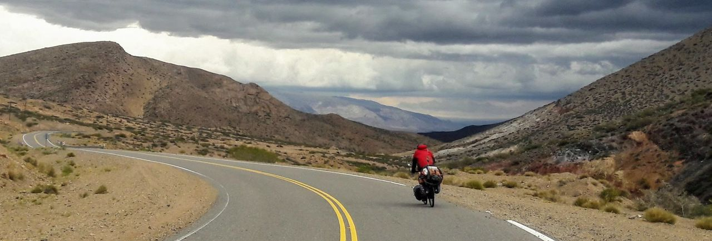
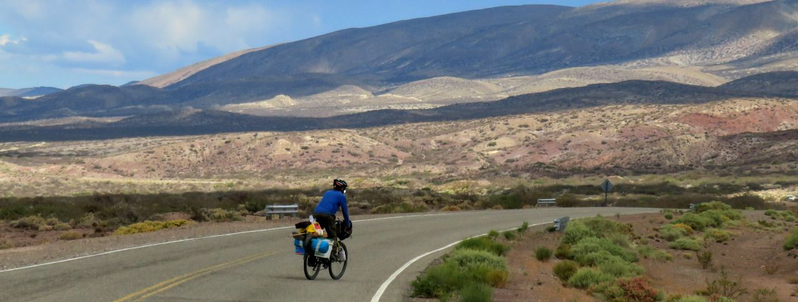
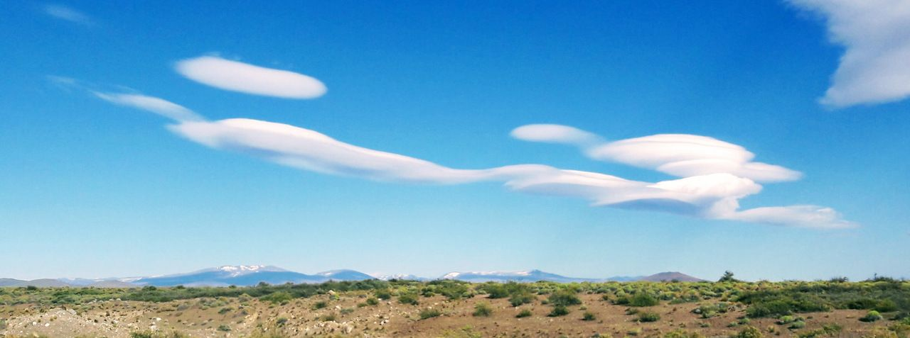
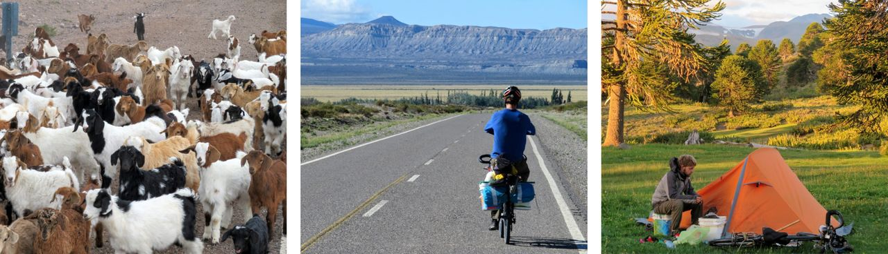

### Argentina - Neuquén, início da Patagônia

#### Dia 51 - 02/12/2017

Levantamos acampamento com paisagens incríveis em todos lados.
Passamos por uma cansativa subida em estrada de rípio, que adentrava um pouco em direção à cordilheira.

Observei um grande rebanho, no topo de um morro, de algum animal que não consegui identificar.
O Rafael parou também, e percebemos que os animais desciam correndo em nossa direção.
Eram centenas de cabras bebês, de várias cores, berrando "bééé".
Elas pulavam e corriam até que pararam todas na estrada olhando para a gente, provavelmente esperando que fossemos alimentá-las.

A altitude elevada nos proporcionou um horizonte distante, apesar de não estar nem perto dos pontos mais altos da cordilheira.
Começamos a descer em curvas num asfalto intacto, olhando rapidamente para todos os lados para aproveitar cada segundo.
Majestosas nuvens escuras e alguns raios de sol tornaram o visual único.
Foi mais impressionante que qualquer foto ou filme que já tenha visto.

Vimos um totem indicando o início da região da Patagônia!
É motivador pensar que já passei por tanta coisa, e ainda tenho a Patagônia pela frente.

Começou a esfriar um pouco, então pela primeira vez, precisei usar mais roupas. 
Já estava na hora, pois fazia dias que pedalava para o sul.
Presenciamos o desmoronamento de um pedaço da estrada, o que nos fez perceber que algo incomum havia com o clima.
Chegando na vila de Barrancas, vimos montes de granizo por todo lado.
Pessoas varriam o granizo para liberar passagem.
Moradores disseram que faziam anos que não caía uma chuva tão forte, mas nós só pegamos um leve chuvisco durante o dia.

#### Dia 52

Em Buta Ranquil, estávamos em dúvida entre ficar ou seguir.
Não achamos camping, então o Rafael me apresentou o iOverlander, um aplicativo colaborativo no qual as pessoas informam locais onde acamparam.
Seguimos até um ponto interessante para acampamento selvagem, ao lado de umas ruínas.
Vimos uma chuva muito forte caindo distante, e novamente nos safamos.

#### Dia 53

Paramos em uma paisagem tão interessante que até o Rafael tirou foto.
Foi a primeira vez que o vi pegar sua câmera.
Eram montanhas cujas camadas geológicas estavam bem visíveis.
Montamos acampamento no camping municipal de Chos Malal, depois passamos na praça para usar wi-fi.

#### Dia 54

Fomos até Chorriaca, uma pequena vila.
Na polícia, perguntamos onde poderíamos pernoitar e sugeriram ficar ali mesmo, no próprio jardim da sede da polícia.

O Rafael e eu conversamos em inglês, já que meu espanhol ainda não estava bom.
Depois de um tempo comecei a compreender o ritmo dele.
Pedalar um pouco mais devagar, aproveitar as descidas para descansar e só fazer paradas se necessário.
Passei a adotar esse ritmo também.
Outra dica muito valiosa foi de cagar sempre de manhã, para não precisar durante o dia.
Uma vantagem de pedalar acompanhado é poder aparecer nas fotos.

#### Dia 55

Começamos o dia com uma longa decida de 40km.
Para compensar, antes de chegar no camping de Las Lajas, pegamos um vento contra forte.

#### Dia 56

Os próximos dias teriam bastante subida e poucos pontos de apoio, então decidimos descansar mais um dia em Las Lajas.
Fui trocar o punho do guidão, o cabo de marcha e a roldana do cambio que estava quebrando.

A partir daqui, a ruta 40 segue mais no lado do deserto argentino, por isso sairíamos dela e seguiríamos em uma ruta mais próxima dos Andes. 

#### Dia 57

Realmente, a subida era interminável, e para dificultar, tinha vento contra.
Mas agora, podia ver a neve na montanha mais de perto.

Achamos um local incrível para acampar.
Tinha um aconchegante gramado colorido com tons amarelos das flores.
No meio deste grande carpete verde e amarelo passava um córrego de água cristalina.
Em volta tinham imponentes araucárias, de uma espécie local, com galhos mais longos e espinhos maiores comparado com as do Brasil.

Durante o dia surgiram nuvens de vários formatos.
Como se as paisagens não bastassem, o céu nos presenteia com lindas surpresas.

#### Dia 58

Me despedi do Rafael, pois ele já tinha vôo comprado em Ushuaia e precisava apressar um pouco a viagem.
Foi muito boa a experiência de viajar junto.
Pude conhecer a perspectiva de alguém que está viajando há mais tempo.
As vezes é um pouco mais difícil tomar todas decisões com alguém do que sozinho, porém nos entendemos bem.
Esquecemos de tirar uma foto nossa, mas talvez porque realmente aproveitamos o momento.

Estava na dúvida se ia conhecer a lagoa na Vila Pehuenia ou se seguia.
O vento me convenceu a seguir até um local que vi no iOverlander, ao lado do rio Aluminé.

#### Dia 59

Segui até o município de Aluminé.
O camping municipal era caro, então fui até a praça, descansar e decidir o que fazer.
Aproveitei para carregar o *power bank* (bateria externa), cozinhar, e usar a wi-fi.

Acabei perdendo, em algum lugar, o meu kit de eletrônicos que tinha o termômetro, o chip de celular brasileiro, o fone de ouvido e a lanterna de cabeça.
Fiquei triste e decepcionado pois tinha pago caro a lanterna de cabeça.
Mas depois lembrei que podia continuar a viagem tranquilamente sem estas coisas.
Refletindo sobre essa lanterna, percebi que as vezes é melhor não ficar dependente do melhor equipamento, mas sim se acostumar com o mais comum e que seja fácil de repor.

Segui até encontrar um local perto do rio Aluminé.
O primeiro já estava ocupado por uma família, então segui até o próximo.
Sempre tento evitar chegar perto da noite, mas dessa vez não consegui e cheguei bem cansado.
Me virei com a luz do celular para cozinhar.

#### Dia 60

Desde Mendoza, pedalo entre os Andes e o deserto argentino.
Passei novamente por deserto, em uma região onde não há cercas separando a estrada das terras.
Às vezes, nessas paisagens agrestes, algo que não entendia muito bem acontecia comigo.
O fato de estar em um lugar muito diferente, fazendo algo incomum, fazia meus pensamentos resgatarem memórias ou sentimentos mais remotos.
A mente começa a devanear, quase como num sonho, no qual a criatividade floresce.
Depois de ter retornado da viagem, vi que Saint-Exupéry, em um de seus livros, relata uma experiência semelhante no deserto do Saara.
Ele ainda constata que o nosso lar acumula "[...] no fundo do coração, uma massa escura da qual brotam como nascentes, os sonhos".
Nesse dia, portanto, ainda não estava começando a ficar louco como imaginei.
Era só mais um curioso sintoma de viajar.

Passei por Junin de los Andes e o camping estava mais caro do que costumava pagar.
Fui seguindo até algum local para acampar perto da estrada, mas acabei andando demais até encontrar.
Fiquei próximo de uma ponte ao lado de um rio muito bonito de água cristalina.
Dessa vez tentei cozinhar antes de escurecer.

#### Dia 61

Levantei acampamento cedo e cheguei antes do meio dia na cidade de San Martin de los Andes.
O Camping também era mais caro, mas acabei ficando pois tinha que me preparar para os próximos dias, na rota dos 7 lagos.
Comprei uma lanterna de cabeça comum, um gorro e uma chave allen 3mm que poderia precisar para ajustar o manete de freio.
Peguei mantimentos no mercado e numa feira.

[Mais fotos do trecho em Neuquén](https://photos.app.goo.gl/s9jRi59zQtJuw4Pk2)