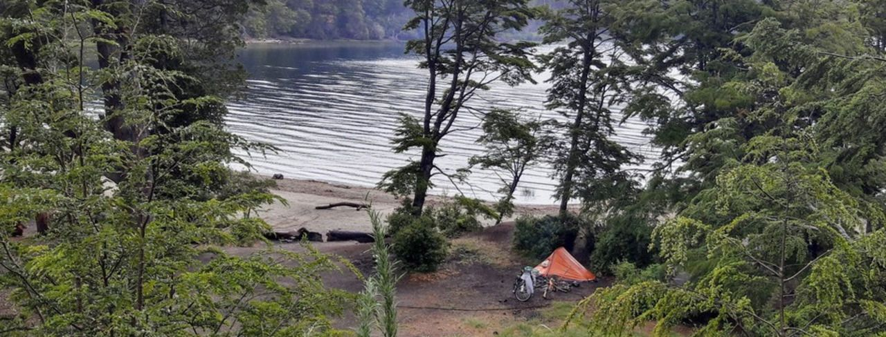
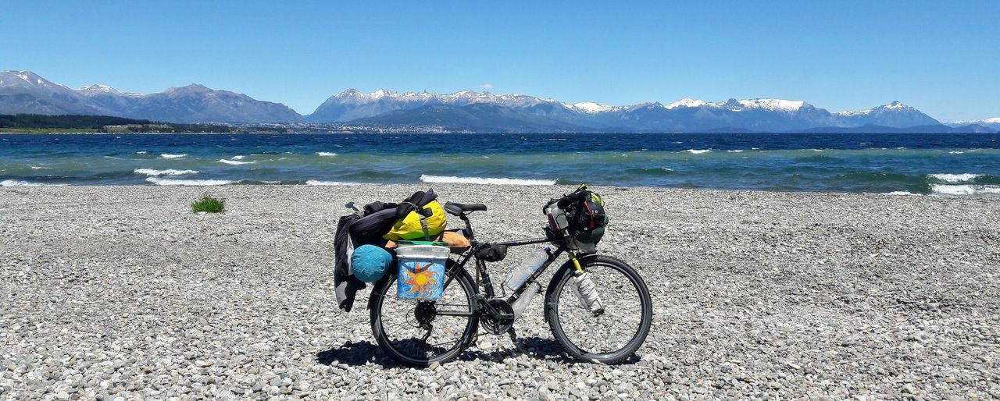
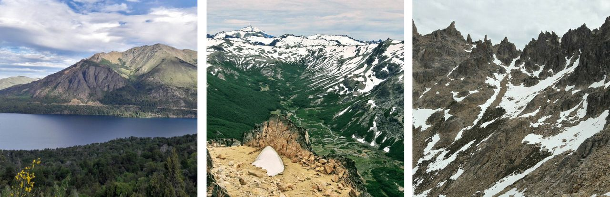

### Argentina - 7 lagos e Bariloche

#### Dia 62 - 13/12/2017

Levantei antes de amanhecer.
Na saída da cidade, dois cachorros me acompanharam.
Nesse dia vi mais cicloviajantes do que todos os dias somados desde o início da viagem.
Encontrei um casal de israelenses e paramos para lanchar e conversar.

Já tinha me informado de que em alguns lagos há *campings libres*, que são locais onde se pode acampar, porém normalmente não há estrutura.
Cheguei no Lago Villariano a tempo de fazer um almoço.
Passei a tarde tocando ukelele, observando pássaros, passeando na floresta, filmando patos na lagoa e escrevendo o diário.

#### Dia 63

Completei dois meses de viagem.

Próximo destino era o Lago Espejo, também com *camping libre*.
Descansei quando cheguei pois havia muitas subidas e descidas.
Cozinhei uma massa para comer no almoço e durante a tarde.

Conheci um motoviajante e o Martin, mochileiro viajando *a dedo* (de carona) desde Mar del Plata.
Saímos para pescar em um outro lago, eu fiz umas tentativas, mas não pegamos nada.
Me contaram sobre uma erupção que deixou cinzas por todo lado.
Realmente, podia se ver uma espessa camada de cinzas no solo.
Quando voltamos, minha barraca estava cheia de cinzas por fora e por dentro, por causa do vento.

#### Dia 64

Acordei tarde e reservei o dia para relaxar.
Assim como os dois últimos dias, o clima estava nublado e chuviscando.

Tomei um mate com o Martin.
Ele foi na rua esperar alguma carona, e eu me apossei do lugar onde ele estava pois não pegava vento e tinha uma fogueira ativa.
Fiz um almoço e duas jantas no fogo.

Perto de escurecer, chegaram uns jovens que viajavam *a dedo*.
Um alemão, uma chilena, um portugês, um chileno e um francês. 
Vieram na minha fogueira, já que estava tudo frio e molhado.

Não me impressionei tanto com as paisagens das lagoas.
Talvez tinha aumentado minha expectativa com o que me contavam e talvez pelo clima.

#### Dia 65

Estava chovendo um pouco, mas precisava seguir pois não tinha mais muita comida.
Foi difícil levantar.
A terra era composta por uma areia escura misturada com partes orgânicas.
No fim, esse composto estava colado em tudo.
Minhas mãos, além de geladas, também tinham essa terra, e não adiantava lavar, pois estava pegando nos equipamentos que estavam sujos.
A barraca depois de empacotada, ficou bem maior e quase não consegui prender na bicicleta.

Cheguei cedo na Villa la Angostura, e assim que parei, comecei a sentir o frio.
Passei no mercado, então preparei um arroz e uma carne de *cedro* (porco) na praça onde tinha wi-fi.
Achei que comer algo quente iria ajudar, mas tinha muito vento e meus pés estavam molhados e frios.

Segui na estrada até encontrar um camping.

#### Dia 66

O dia nasceu bonito e com muito sol.
O lago estava azulão finalmente.
Cheguei em Dina Huapi cedo e fiquei o resto do dia num local muito bom para acampar.
Ao lado do lago, com muito espaço e com uma vista para Bariloche e as montanhas nevadas ao fundo.
Lavei tudo e estendi ao sol até secar.
Nunca teria dado tanto valor a um simples dia de sol, se não fosse antecedido de um dia frio e chuvoso.

#### Dia 67

Cheguei em Bariloche de manhã e não sabia o que fazer.
Não tinha planejado nada e nem conhecia a cidade.
Dei umas voltas na cidade e me deparei com uma manifestação.

Busquei informações no centro de turismo e no wi-fi de uma padaria.
Decidi conhecer um tal de cerro Catedral no dia seguinte.

Com o sol se pondo mais tarde, deu tempo de encontrar um lugar perfeito para passar a noite de graça em Bariloche.
Era uma praia quase deserta com um visual incrível.

#### Dia 68

Saí em direção ao Catedral e subi o cerro de teleférico.
Só levei carteira, documentos, comida e água.
A bicicleta, prendi em uma grade.

A vista lá de cima é fantástica.
As montanhas nevadas e o verde no vale.
A trilha passa por um lado da montanha que é cheio de pedras empilhadas.
Alguns pontos vermelhos pintados nas pedras indicam o caminho.
Depois, a trilha continua na neve, e foi onde pude tocar nela pela primeira vez.
Era muito divertido descer os morros escorregando de bunda.
A neve estava derretendo e criando formas muito interessantes.

Lanchei sanduíche de sardinha.
Cheguei no refúgio onde as pessoas passam a noite, porém eu me programei para voltar.
Lembrei que o teleférico desligaria às 17h, então apressei o passo.
Logo percebi que estava muito atrasado.
Passei o resto do caminho todo correndo, inclusive nas pedras.
Me senti naquelas cenas de filmes de ação, onde o personagem passa por uma paisagem incrível mas não dá a mínima.

Tarde demais.
Tinham passados 15min das 17h e já conseguia ver o teleférico parado.
A estrada para descer era muito longa e eu não tinha quase nada de água e comida.
Provavelmente chegaria de noite mesmo com o sol se pondo mais tarde.
Devia ter lembrado que sou amador no *trekking*.
Fiquei tão distraído com as paisagens e com a neve que esqueci de estimar o tempo da volta. 
Mas vi bem de longe, um carro saindo dos teleféricos, então corri abandando com as mãos na esperança de que me vissem.
Por minha sorte alguém do carro deve ter olhado para trás e pararam.
Foi por muito pouco.
De carro, demoramos bastante para descer, fiquei imaginando como seria à pé.

Minha bicicleta estava lá com meus alforges e tudo.
Minhas pernas estavam muito exaustas.
Ainda andei uns 19km e acampei em um local bem bonito ao lado da lagoa.

<!--

#### Dia 69

Cheguei cedo em Rio Villegas e comprei comida.
Fui no camping de melhor preço, mas a água do chuveiro não era muito quente.

Peguei o costume de deixar uma garrafa pet aquecendo próxima da fogueira, depois trazer para dentro do saco de dormir.
Mas dessa vez não consegui acender o fogo, pois tinha chovido um pouco.

-->

[Mais fotos do trecho ruta dos 7 lagos e Bariloche](https://photos.app.goo.gl/XNWxm945LxK59tDk2)

