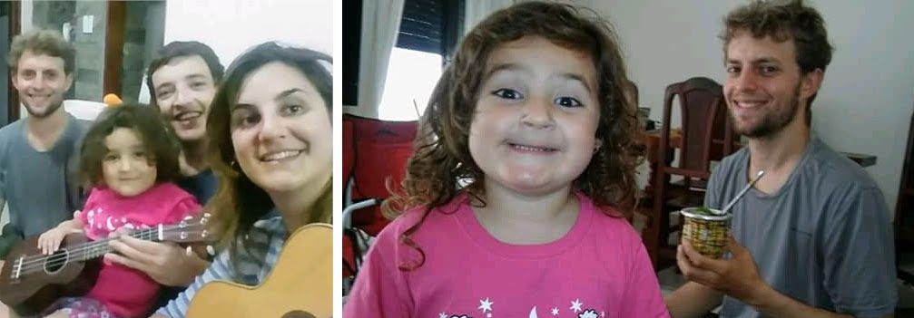

### Argentina - Santa Fé e Laguna Miramar

#### Dia 19

Em breve...

<!--

São Tomé - Fui até o município de Paraná na entrada do túnel.
Um supervisor me levou numa caminhonete até o outro lado do túnel.
Dei umas voltas pela cidade até encontrar um óculos EPI escuro.
Esse é o terceiro que tenho.
Em Santa Fé também queria trocar uns reais por pesos.
Esperei até abrir depois das 16:30 e o cambio não abriu.
Fui para o camping municipal..25 pesos.
*falar dos campings municipais* 

#### Dia 20

Sá Pereira.
Voltei até Santa Fé para trocar reais e pediram o passaporte... começando o dia andando 15km em vão.
Voltei para buscar, tinha um vento lateral a favor.
Estrada boa.
Fiquei nos bombeiros, deram janta, fomos buscar.

#### Dia 21

Colonia Cello

Esperei nos bombeiros até parar a chuva.
Estrada boa, vento favorável.
Cheguei na policia, não tinha ninguém, o visinho começou a conversar e logo já ofereceu a casa.
Gaston, Sofia e a filha Anita.
Sofia Tocou umas músicas argentinas - zamba carpera, chamamé, carnavalito, Gato, chacarera.
A praça é quase maior que a cidade.
Tinha gravado as músicas que ela tocou, mas perdi.

#### Dia 22

La Paquita

Por muitoa sorte no dia que eu mudo de direção, o vento muda também a meu favor.
Passo por San Francisco, alguém passando de carro grita de longe  "dónde es?".

Um motorista faz sinal para eu parar e me oferece uma pizza! Já tinham parado no meio do pampa gaucho pra dar umas laranjas e bergamotas, mas uma pizza quentinha!!?

Em La Paquita a policia indica um estabelecimento tipo CTG para pernoitar.
Uma pessoa convida para um mate na manhã seguinte e também para um aniversário de um bebê de 1 ano.

#### Dia 23

Miramar - Laguna mar Chiquita

Vejo muitos pássaros atravessando a rua voando toda a manhã.
Chegando em Miramar, passo pelo hotel abandonado Viena, fico num camping próximo.
Vejo Flamingos de longe.

#### Dia 24

La Para

Vou até outro ponto próximo da laguna em um camping.
Um grupo de homens argentinos me convidam para se juntar e oferecem assado.

### Argentina - Sierras Chicas de Cordoba

Em breve...

### Argentina - Los Gigantes e Los Tuneles

Em breve...

Cansei de ficar se preocupando no que postar nas redes e decidi aproveitar o agora 

Dica preciosa: Cagar de manha

Foto de flor com andes no fundo

Estar fazendo algo muito diferente fez acessar memórias do subconciente

Niveis de mulambiker - uruguai barraca (lona que coloca na cerca)

Botar oleo na correia, anel por anel

-->

