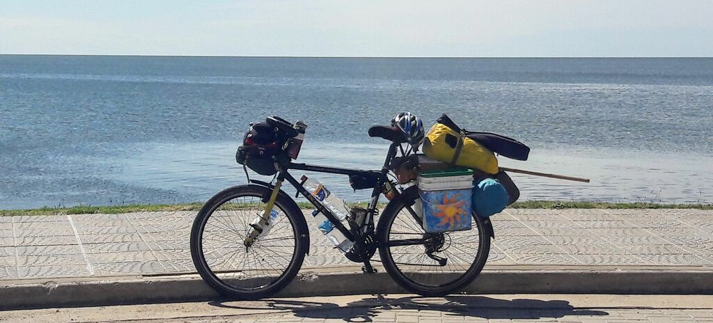

### Argentina - Santa Fé e Laguna Miramar

#### Dia 19

Fui até o município de Paraná na entrada do túnel onde um supervisor me levou numa caminhonete até o outro lado.
Acabei perdendo pela segunda vez os óculos EPI de sol, então dei umas voltas pela cidade até encontrar um novo.
Queria também trocar uns reais por pesos.
Esperei até o cambio abrir depois das 16:30 conforme tinha me informado, mas não abriu.
Fui para o camping municipal de São Tomé, cidade visinha.

#### Dia 20

Voltei até Santa Fé sem a bagagem para trocar reais no cambio porém pediram o passaporte, então tive que voltar para pegar.
Comecei o dia pedalando 15km em vão.
Segui até Sá Pereira.
Lá fiquei nos bombeiros onde fui muito bem recebido. 
Fomos buscar uma janta e eles não aceitaram meu pagamento.

#### Dia 21

Esperei nos bombeiros até parar a chuva.
Até aqui a primeira desde o Rio Grande do sul, porém nem atrapalhou.
A estrada estava ótima, bem pouco movimento, vento favorável.
Parei em uma pequena cidade chamada Colonia Cello cuja praça é quase maior que a própria cidade.
Fui na polícia, mas não tinha ninguém.
Havia uma missa terminando na igreja ao lado, provavelmente toda população estava lá, inclusive os policiais.
Um morador começou a conversar comigo e acho que em menos de 30 segundos já estava oferecendo pouso em sua casa.
Gaston, Sofia e a filha Anita.
Sofia tocou vários estilos de músicas argentinas - zamba carpera, chamamé, carnavalito, Gato, chacarera.

Tinha gravado as músicas que ela tocou, mas perdi.

#### Dia 22

La Paquita

Por muitoa sorte no dia que eu mudo de direção, o vento muda também a meu favor.
Passo por San Francisco, alguém passando de carro grita de longe  "dónde es?".

Um motorista faz sinal para eu parar e me oferece uma pizza! Já tinham parado no meio do pampa gaucho pra dar umas laranjas e bergamotas, mas uma pizza quentinha!!?

Em La Paquita a policia indica um estabelecimento tipo CTG para pernoitar.
Uma pessoa convida para um mate na manhã seguinte e também para um aniversário de um bebê de 1 ano.

#### Dia 23

Miramar - Laguna mar Chiquita

Vejo muitos pássaros atravessando a rua voando toda a manhã.
Chegando em Miramar, passo pelo hotel abandonado Viena, fico num camping próximo.
Vejo Flamingos de longe.

#### Dia 24

La Para

Vou até outro ponto próximo da laguna em um camping.
Um grupo de homens argentinos me convidam para se juntar e oferecem assado.

### Argentina - Sierras Chicas de Cordoba

Em breve...

### Argentina - Los Gigantes e Los Tuneles

Em breve...

<!--

Cansei de ficar se preocupando no que postar nas redes e decidi aproveitar o agora 

Dica preciosa: Cagar de manha

Foto de flor com andes no fundo

Estar fazendo algo muito diferente fez acessar memórias do subconciente. A mente estava quase como num sonho, a gente é mais inteligente.

Niveis de mulambiker - uruguai barraca (lona que coloca na cerca)

Botar oleo na correia, anel por anel

Trocar correia

"Às vezes, na vida, não acontece nenhuma lição, acontece só um monte de doidera mesmo" Seu Edson

-->

