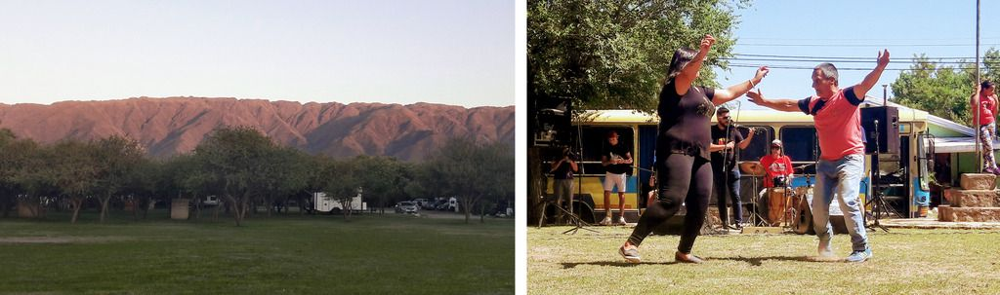

### Argentina - San Luis

#### Dia 35

A estrada continuava de rípo.
Encontrei o policial de Pocho no caminho.
Na cidade de Cura Brochero tem um rio muito bonito que passa entre rochas.
Tem muitos campings, então fiz uma pesquisa de preço e acabei ficando no municipal, que não tinha ninguém, ou seja, era free.

#### Dia 36

Passei por muitas cidades e parei em La Paz.
Fiquei no camping municipal que também não tinha ninguém.

#### Dia 37

Continuei indo a sul com com uma bela vista para a serra na minha esquerda.
Estava precisando de um banho quente e descansar pois nos últimos campings não tinha chuveiro.
Cheguei cedo num camping pago em Carpinteria, lavei roupas e dei um banho de sol no saco de dormir.

#### Dia 38

Passei por mais alguns *pueblos*, dentre eles Papagayos, uma pequena vila de menos de mil habitantes.
Na praça da vila havia umas bandas se apresentando, portanto sem dúvidas fiquei ali.
Assisti à três bandas de *chacarera*, cada uma muito particular.
Usavam violão, violino, bateria e o *bombo legüero*.

As pessoas começavam a coreografia tradicional ao ovirem o chamado *¡Adentro!*.
Davam giros com os braços estendidos acima da cabeça e estalando os dedos.
Outros demonstravam suas habilidades com sapateados complexos.

Fui para o camping municipal.
Tinha bastante vento então acabei cozinhando de baixo de uma *parrilla*.

#### Dia 39

Comecei o dia com uma leve decida de 30 kilometros em estrada de rípio.
Andei bastante e descansei ao meio dia na praça de um povoado.
Estava atirado na grama e duas mulheres me convidaram pra ir na sua casa.
Ganhei almoço.
Conheci o filho e seus amiguinhos que andavam de bici. Eles adoraram ver minha bike carregada.

Seguindo até La Toma, percebo que estou entrando em região desértica, não só pela ausência de árvores mas pelos santuários da Difunta Correa.
Segundo a lenda, Deolinda Correa era uma jovem mulher que morreu de sede no deserto, mas o bebê que levava no colo sobreviveu com o leite que restava dela. 
Por isso há nesses santuários uma grande quantidade de garrafas de água.

Fiquei num camping que tinha um rio meio seco e feio.

#### Dia 40

Encontrar local para pernoitar em uma cidade grande pode ser mais custoso e demorado.
Então, antes de chegar na capital San Luis, já estava observando as possibilidades de pernoite.
Um ciclista começou a conversar comigo e sugeriu ir no Lago Potrero de Los Funes.
Ele ligou para o dono de um camping que deixou ficar de graça.
O lago é rodeado por montanhas e um circuito de corrida.
Tive um pouco de dificuldade para achar o camping.

Casualmente encontrei um casal de velinhos viajando em trailer, que também havia visto no dia anteriror.
Conversamos um pouco em espanhol e inglês, me mostraram o trailer e me deram um chocolate.

#### Dia 41

Em San Luis conheci o Santiago com quem tinha feito contato pelo *warmshowers*.
Ele também já fez cicloviagens.
Cheguei ao meio dia e almoçamos juntos.
Passeamos na praça e aproveitei pra tentar sacar dinheiro, mas não consegui. 
Ele me mostrou um parque de Le Parkour que tem na cidade.
À noite chegou mais gente da família dele.
Agradeço muito ao Santiago, seus pais e irmãos.

#### Dia 42

Uma decida constante e leve me fez andar 40km sem paradas.
Já distante da serra, a paisagem é bem arbustiva.
Cheguei em Beazley, uma vila meio desértica.

O próximo ponto de apoio seria em uns 160km, em Monte Comán.
Até o momento a maior distância que percorreria sem a garantia de água ou comida.
Além disso não deixei de reparar no mapa que há um trecho de 110km sem absolutamente nenhuma curva e muito provavelmente sem sombra e sem distração na paisagem.
Sinto que será uma interessante travessia.

Teria que andar mais um pouco caso quisesse aproveitar o vento a favor no dia seguinte, conforme já tinha visto no app Windy.
Descansei na praça de Beazley e segui.
Antes de escurecer, escolhi para pernoitar, o espaço que tivesse menos arbustos e menos visibilidade da rua.
Decidi dormir somente com o saco de dormir e o colchonete, sem montar a barraca, ou bivaque como é chamado esse tipo de acampamento.
Não foi muito confortável porque tinha um pouco de vento e o chão era de areia.
Mas valeu muito a pena pois vi um meteoro entrando na atmosfera.
O rastro dele se estendeu por quase todo céu, e ao final se dividiu em pequenos pedaços que se desintegraram.
Sem dúvida o maior que já vi.

[Mais fotos do trecho em San Luis](https://photos.app.goo.gl/vyKhBGIpazr7HDX43)

